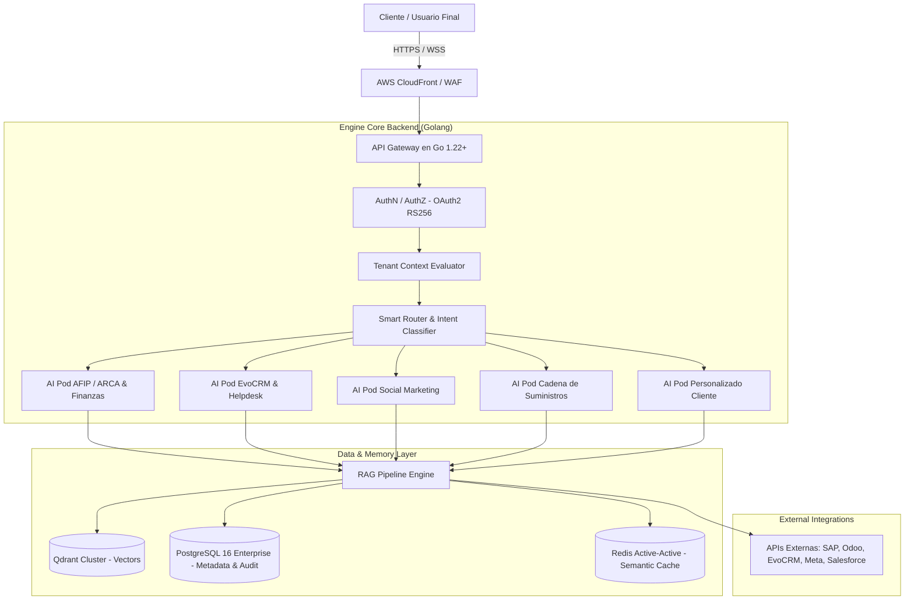

# 📐 Documento de Diseño de Software (SDD) - AI Pods Enterprise SaaS Platform

**Proyecto:** Plataforma SaaS Multi-Tenant de AI Pods Empresariales Universal (APIs, ERPs & CRMs)  
**Autor:** Martin Llanos  
**Fecha:** Julio 2026  
**Versión:** 4.0.0  
**Licencia:** Propietaria y Confidencial  

---

## 1. Introducción y Objetivos de Arquitectura

El objetivo de este proyecto es construir una plataforma SaaS multi-tenant basada en una arquitectura RAG (Retrieval-Augmented Generation) de alto rendimiento, auditable y de alta disponibilidad. El sistema permite "clonar" e institucionalizar el conocimiento de consultores senior especializados en **AFIP/ARCA**, **EvoCRM**, **Odoo**, **SAP**, **Salesforce** y **Cadena de Suministros (SCM)** a través de agentes inteligentes autónomos ("AI Pods").

Las limitaciones operativas y reglas de negocio del sistema residen exclusivamente **dentro de cada AI Pod**. Cada AI Pod es un plugin especializado e independiente que se conecta vía API, Webhooks o logins a su sistema de destino correspondiente.

---

## 2. Arquitectura de Componentes de Alto Nivel

---

## 3. Principios Invariantes de la Plataforma

1. **Aislamiento Multi-Tenant Absoluto:**  
   Todas las consultas a PostgreSQL y Qdrant DEBEN incluir el filtro `WHERE (tenant_id == CurrentTenantID OR tenant_id == 'GLOBAL') AND status == 'ACTIVE'`.
2. **Resiliencia Geo-Distribuida:**  
   Replicación Active-Active en Redis (CRDTs) y colas NATS JetStream para funcionamiento ininterrumpido en entornos remotos o pozos petroleros.
3. **Protocolo Obligatorio Dry-Run (`dry_run = true`):**  
   Ninguna herramienta con efectos secundarios muta bases de datos de producción sin simulación previa y token de confirmación humana (*Human-in-the-Loop*).
4. **Independencia del Backend respecto al Dominio:**  
   El backend en Go es 100% agnóstico del sistema final; la lógica de conexión y negocio reside en las especificaciones del AI Pod.
