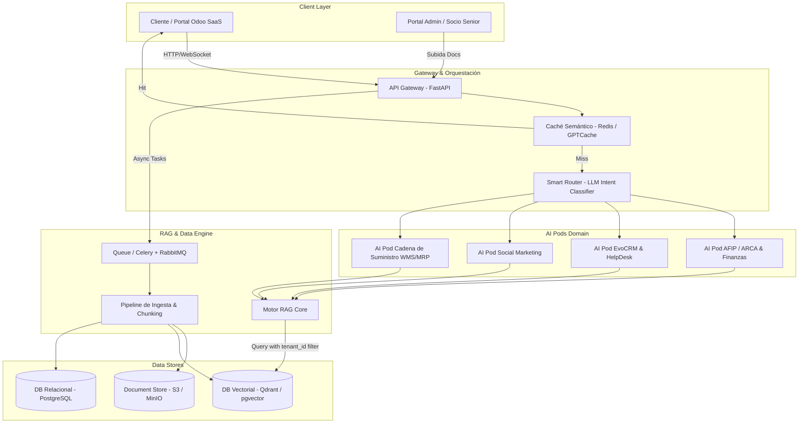

# 📐 Documento de Diseño de Software (SDD) - AI Pods Odoo SaaS

**Proyecto:** Plataforma SaaS de AI Pods para Consultoría Odoo  
**Versión:** 1.0.0  
**Fecha:** Julio 2026  
**Estado:** Propuesto / Aprobación  

---

## 1. Visión General y Objetivos del Sistema

### 1.1 Propósito
El objetivo de este proyecto es construir una plataforma SaaS multi-tenant basada en una arquitectura RAG (Retrieval-Augmented Generation) de alto rendimiento. El sistema permite "clonar" y disponibilizar el conocimiento de consultores senior especializados en **Odoo**, **AFIP/ARCA**, **EvoCRM** y **Cadena de Suministros (SCM)** a través de agentes inteligentes autónomos ("AI Pods").

### 1.2 Objetivos Principales
* **Multi-tenancy Escusable (+200 Empresas):** Aislamiento estricto y seguro de datos por cliente utilizando filtrado de metadatos en la base de datos vectorial y base relacional.
* **Orquestación Inteligente (Smart Router):** Clasificación automática de intenciones mediante LLM liviano para enrutar consultas al AI Pod especializado adecuado.
* **Respuesta de Alta Precision sin Alucinaciones:** Pipeline RAG enriquecido con citas explicitas y contexto verificado por consultores Senior.
* **Optimización de Costos y Latencia:** Capa de caché semántico (Redis/GPTCache) con umbral de similitud configurado ($\ge 95\%$) y procesamiento asíncrono en colas (Celery/RabbitMQ).
* **Mantenimiento del Conocimiento (Data CI/CD):** Sistema dinámico de versión e invalidación de vectores para actualización continua de normativas y documentaciones sin tiempo de inactividad.

---

## 2. Arquitectura General del Sistema

### 2.1 Diagrama de Arquitectura (High-Level Architecture)



---

## 3. Especificación de Subsystemas

### 3.1 API Gateway & Smart Router (Épica 5)
El **Smart Router** actúa como el punto de entrada unificado para todas las consultas.
* **Entrada:** Mensaje en texto plano del usuario, ID de conversación, `tenant_id`.
* **Mecanismo de Clasificación:**
  1. Se evalúa un modelo rápido (ej. `Claude 3 Haiku` o `GPT-4o-mini`).
  2. El modelo analiza la intención y selecciona uno o más Pods relevantes:
     - `AFIP_FINANCE`: Consultas de facturación, certificados, impuestos, balances.
     - `EVOCRM_HELPDESK`: Webhooks, mensajería WhatsApp, tickets Odoo.
     - `SOCIAL_MARKETING`: Publicaciones, tokens Meta/Instagram.
     - `SCM_LOGISTICS`: Rutas WMS, reglas de reabastecimiento, listas BoM, Landed Costs.
  3. **Descomposición de Consultas Complejas:** Si la consulta abarca múltiples dominios (ej. "Problema al importar producto y facturarlo"), el Router divide el prompt en sub-consultas y consolida las respuestas de los Pods involucrados.

### 3.2 AI Pods (Épicas 1, 2, 3, 4)
Cada **AI Pod** es una instancia lógica configurada con:
* **System Prompt Especializado:** Instrucciones estrictas sobre tono, terminología de Odoo y procedimientos del dominio.
* **Herramientas (Tools) Asociadas:** Generador de comandos OpenSSL, validador de JSON/Webhooks, analizador de balances.
* **Contexto RAG Dedicado:** Filtros de espacio de nombres o etiquetas de dominio en la Base Vectorial.

### 3.3 Pipeline de Ingesta y Vectorización (Épica 6 & 10)
Proceso encargado de procesar la documentación provista por los Socios Seniors:
1. **Extracción y Limpieza:** Procesamiento de PDF, DOCX, CSV, Markdown mediante extractores estructurados.
2. **Chunking Inteligente:** División adaptativa de texto (ej. 512-1024 tokens) con un solapamiento (overlap) de 10-15% para preservar continuidad contextual.
3. **Generación de Embeddings:** Uso de modelos estándar de alta precisión (ej. `text-embedding-3-small` o `bge-large-en/es`).
4. **Almacenamiento y Tagging:** Inserción en la Base Vectorial asignando metadatos requeridos (`tenant_id`, `doc_id`, `version`, `domain`, `is_global`, `status`).

---

## 4. Estrategia Multi-Tenant y Seguridad (Épica 8)

### 4.1 Aislamiento de Datos por Metadatos
Para soportar +200 empresas sin costo ni complejidad excesiva de infraestructura por cliente, se utiliza un modelo de **Base Vectorial Compartida con Aislamiento Estricto por Metadatos**.

#### Esquema de Consulta RAG Seguro:
Toda consulta enviada a la BD Vectorial **debe** incluir obligatoriamente el siguiente filtro lógico:

$$\text{Filtro} = (\text{tenant\_id} == \text{CurrentTenantID} \lor \text{tenant\_id} == \text{"GLOBAL"}) \land \text{status} == \text{"ACTIVE"}$$

```json
{
  "filter": {
    "must": [
      { "key": "status", "match": { "value": "ACTIVE" } }
    ],
    "should": [
      { "key": "tenant_id", "match": { "value": "tenant_12345" } },
      { "key": "tenant_id", "match": { "value": "GLOBAL" } }
    ]
  }
}
```

> ⚠️ **REGLA CRÍTICA DE SEGURIDAD:** Ninguna consulta a la Base Vectorial puede ejecutarse sin un `tenant_id` válido adjunto en el token JWT / Contexto de la sesión.

---

## 5. Optimización de Costos y Rendimiento (Épica 9)

### 5.1 Caché Semántico (Redis + Vector Similarity)
Para prevenir costos redundantes de APIs de LLM y reducir latencia a $<100\text{ms}$ en consultas frecuentes:

1. Cuando un usuario envía una pregunta $Q$, se genera su embedding $E(Q)$.
2. Se busca en el caché semántico dentro del espacio del tenant (`tenant_id`):
   - Si la similitud coseno entre $E(Q)$ y una pregunta guardada $E(Q_{cached})$ es $\ge 0.95$:
     - Se retorna inmediatamente la respuesta guardada en memoria.
   - Si la similitud es $< 0.95$:
     - Se prosigue con la ejecución normal del Pipeline RAG + LLM y se almacena la respuesta en caché con un TTL (Time-To-Live) configurable.

### 5.2 Procesamiento Asíncrono de Tareasy Colas (Celery + RabbitMQ)
* Operaciones pesadas (ingesta de balances de 50+ páginas, re-vectorización masiva, reportes financieros extensos) se encolan en **RabbitMQ** y son procesadas en segundo plano por trabajadores **Celery**.
* Esto previene el bloqueo del API Gateway y evita golpear los límites de Rate Limit (TPM/RPM) de los proveedores de LLM.

---

## 6. Modelo de Datos y Esquemas

### 6.1 Registro de Documentos (Base Relacional PostgreSQL)

```sql
CREATE TABLE documents (
    id UUID PRIMARY KEY DEFAULT gen_random_uuid(),
    tenant_id VARCHAR(64) NOT NULL, -- 'GLOBAL' para docs públicos de la plataforma
    title VARCHAR(255) NOT NULL,
    domain VARCHAR(50) NOT NULL, -- 'AFIP', 'SCM', 'CRM', 'SOCIAL'
    file_path TEXT NOT NULL,
    version INT DEFAULT 1,
    status VARCHAR(20) DEFAULT 'ACTIVE', -- 'ACTIVE', 'OBSOLETE', 'PROCESSING'
    created_at TIMESTAMP WITH TIME ZONE DEFAULT CURRENT_TIMESTAMP,
    updated_at TIMESTAMP WITH TIME ZONE DEFAULT CURRENT_TIMESTAMP
);

CREATE INDEX idx_docs_tenant_domain ON documents(tenant_id, domain, status);
```

### 6.2 Esquema de Metadatos de Vectores (JSON Payload)

```json
{
  "chunk_id": "c7f1a8b4-93e1-4f32-8b9a-112233445566",
  "doc_id": "d1234567-89ab-cdef-0123-456789abcdef",
  "tenant_id": "tenant_empresa_acme",
  "domain": "AFIP",
  "is_global": false,
  "status": "ACTIVE",
  "version": 2,
  "content": "Para generar el CSR en AFIP ejecute: openssl req -new -key privada.key -out pedido.csr...",
  "source_file": "manual_afip_v2.pdf",
  "page_number": 4
}
```

---

## 7. Especificación de APIs principales

### 7.1 Endpoint: Chat / Consulta a Pods
* **POST** `/api/v1/chat/completions`

#### Request Body:
```json
{
  "tenant_id": "empresa_123",
  "session_id": "sess_8899",
  "message": "¿Cómo configuro el costo de importación Landed Costs en Odoo?",
  "stream": true
}
```

#### Response Body (Stream SSE o JSON):
```json
{
  "session_id": "sess_8899",
  "routed_pod": "SCM_LOGISTICS",
  "response": "Para configurar Landed Costs en Odoo, debes seguir los siguientes pasos...",
  "citations": [
    {
      "doc_title": "Guia_Landed_Costs_Odoo16.pdf",
      "page": 12,
      "snippet": "El prorrateo de fletes se activa en Compras > Ajustes..."
    }
  ],
  "cached": false
}
```

### 7.2 Endpoint: Ingesta de Documentos (Data CI/CD)
* **POST** `/api/v1/admin/documents/upload`

#### Request Body (Multipart Form):
* `file`: Archivo en formato PDF/DOCX.
* `tenant_id`: "GLOBAL" o ID específico de empresa.
* `domain`: "AFIP" | "SCM" | "CRM" | "SOCIAL".
* `replaces_doc_id`: (Opcional) UUID del documento obsoleto a reemplazar.

---

## 8. Stack Tecnológico Recomendado

| Capa | Tecnología Seleccionada | Justificación |
| :--- | :--- | :--- |
| **Backend / API** | Python 3.11 + FastAPI | Alto rendimiento asíncrono y excelente soporte para ecosistemas de IA. |
| **Orquestación RAG** | LangChain / LlamaIndex | Facilidad para conectar agentes, routers y retrievers con filtros de metadatos. |
| **Base Vectorial** | Qdrant / PostgreSQL (pgvector) | Excelente soporte de filtrado por metadatos (tenant_id) y alto throughput. |
| **Base Relacional** | PostgreSQL 16 | Gestión de usuarios, tenants, metadatos de documentos y logs de auditoría. |
| **Caché Semántico** | Redis + GPTCache | Reducción del costo de tokens en consultas repetitivas. |
| **Colas Asíncronas** | Celery + RabbitMQ | Procesamiento distribuido no bloqueante para tareas largas e ingesta de documentos. |
| **Modelos LLM** | Claude 3.5 Sonnet / GPT-4o (Generación)<br>Claude 3 Haiku / GPT-4o-mini (Router) | Balance óptimo entre capacidad de razonamiento técnico y costo/velocidad en enrutamiento. |

---

## 9. Plan de Implementación por Sprints

### Sprint 1: MVP Técnico & Prueba de Concepto (PoC)
* Setup de infraestructura básica (FastAPI + PostgreSQL/pgvector + Redis).
* Implementación de la **Épica 6 (Ingesta de documentos)** y **Épica 8 (Multi-tenant filtering)**.
* Despliegue del primer Pod funcional: **Épica 1 (AI Pod AFIP/ARCA)**.

### Sprint 2: Smart Router & Resto de AI Pods
* Desarrollar e integrar **Épica 5 (Smart Router)** con clasificación de intenciones.
* Configuración de Pods de EvoCRM (Épica 2), Social Marketing (Épica 3) y SCM (Épica 4).

### Sprint 3: Optimización, Caché & Lifecycle CI/CD
* Integración de la capa de **Caché Semántico** (Épica 9.1) y **Colas Celery** (Épica 9.2).
* Módulo de **Actualización e Invalidación de Vectores** (Épica 10.1).
* Pruebas de estrés y seguridad multi-tenant.
