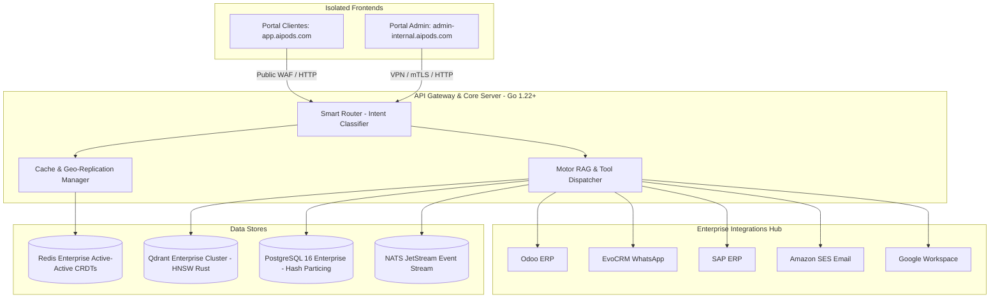

# 📐 Documento de Diseño de Software (SDD) - AI Pods Odoo & Enterprise SaaS

**Proyecto:** Plataforma SaaS de AI Pods para Consultoría Odoo y Sistemas Empresariales  
**Versión:** 1.3.0  
**Fecha:** Julio 2026  
**Estado:** APROBADO / STACK EMPRESARIAL DEFINIDO  

---

## 1. Visión General y Objetivos del Sistema

### 1.1 Propósito
El objetivo de este proyecto es construir una plataforma SaaS multi-tenant basada en una arquitectura RAG (Retrieval-Augmented Generation) de alto rendimiento, auditable y de alta disponibilidad. El sistema permite "clonar" y disponibilizar el conocimiento de consultores senior especializados en **Odoo**, **AFIP/ARCA**, **EvoCRM**, **SAP** y **Cadena de Suministros (SCM)** a través de agentes inteligentes autónomos ("AI Pods").

### 1.2 Objetivos Principales de Arquitectura
* **Backend Auditable y de Alta Estabilidad (Go 1.22+):** Cero "magia", mínimas dependencias externas (Supply Chain Security) y retrocompatibilidad estricta.
* **Escalabilidad Multi-Tenant (+200 Empresas & Millones de Registros):** Particionado nativo de tablas relacionales en PostgreSQL 16 Enterprise por `tenant_id` e indexado vectorial en Qdrant Enterprise Cluster.
* **Resiliencia Multi-Sitio (Active-Active Geo-Failover):** Caché semántico en Redis Enterprise Active-Active (CRDTs) y colas NATS JetStream para garantizar funcionamiento ininterrumpido en entornos remotos o Edge (ej. pozos petroleros).
* **Seguridad de Portales Aislados (Zero-Trust Domain Separation):** Separación total de dominios e infraestructura entre el Portal de Clientes y el Portal de Administración Interna.

---

## 2. Arquitectura General del Sistema

---

## 3. Especificación del Stack Tecnológico

| Capa de Arquitectura | Tecnología Seleccionada | Justificación Clave |
| :--- | :--- | :--- |
| **Backend Core & API Gateway** | **Go (Golang 1.22+)** | Máxima auditabilidad, retrocompatibilidad estricta (Go 1.x), mínimas dependencias externas y microsegundos de latencia. |
| **Base Relacional & Metadatos** | **PostgreSQL 16 Enterprise** | Soporte SLA 24/7 (EDB / AWS Aurora), particionado nativo de tablas por `tenant_id` para soportar millones de filas y replicación Multi-AZ. |
| **Base Vectorial (RAG Engine)**| **Qdrant Enterprise Cluster** | Motor vectorial en Rust con soporte SLA 24/7, certificaciones ISO 27001 / SOC2, sharding distribuido y filtrado en $<10\text{ms}$. |
| **Caché Semántico Geo-Replicado**| **Redis Enterprise Active-Active** | Replicación multi-sitio bi-direccional en tiempo real (CRDTs). Conmutación transparente en $<100\text{ms}$ si se cae un sitio/región. |
| **Streaming & Colas Asíncronas**| **NATS JetStream (en Go)** | Resiliencia para ubicaciones remotas/Edge con conectividad intermitente (*Store-and-Forward*). |
| **Portales Frontend Aislados** | **React 18 + Vite + TypeScript** | Dos compilados SPA 100% aislados en dominios/subredes independientes para clientes y administradores. |

---

## 4. Gobernanza de Seguridad Multi-Tenant y Portales

### 4.1 Aislamiento de Red y Dominios (Zero-Trust)
1. **Domain Isolation:** El Portal de Clientes (`app.aipods.com`) solo puede consultar la ruta `/api/v1/chat/*`. La ruta `/api/v1/admin/*` está totalmente bloqueada en los Ingress Controllers públicos.
2. **Multi-Tenant Filter Invariant:** Toda consulta a PostgreSQL o Qdrant incluye obligatoriamente:
   $$\text{Filtro} = (\text{tenant\_id} == \text{CurrentTenantID} \lor \text{tenant\_id} == \text{"GLOBAL"}) \land \text{status} == \text{"ACTIVE"}$$

---

## 5. Integración Multicapa Empresarial

El backend en **Go** expone conectores nativos y adaptadores seguros para los siguientes sistemas empresariales:
* **Odoo ERP:** Integración mediante conectores XML-RPC / JSON-RPC y REST API para consulta de módulos WMS, MRP, Compras y Helpdesk.
* **EvoCRM:** Webhook Receiver y API Client para recepción y envío de mensajes en WhatsApp Omnicanal.
* **SAP ERP:** Integración de datos vía protocolos OData / REST.
* **Amazon SES & Google Workspace:** Envío de correos transaccionales y consulta de documentación en Google Drive / Gmail APIs.
