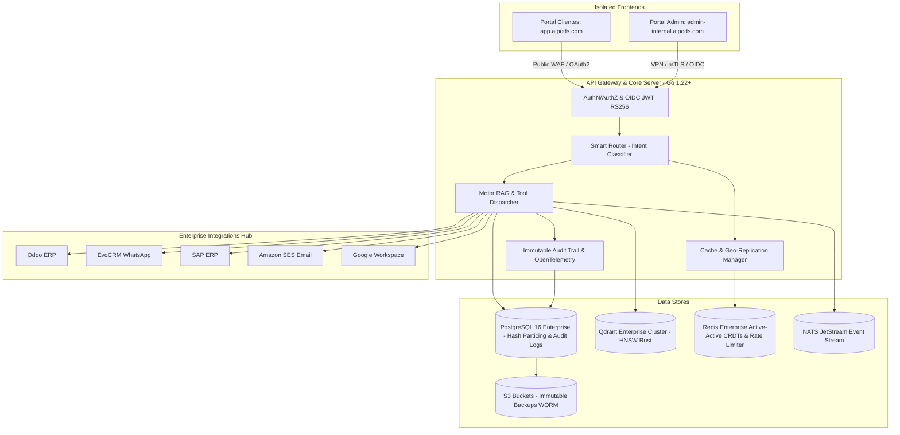

# 📐 Documento de Diseño de Software (SDD) - AI Pods Odoo & Enterprise SaaS

**Proyecto:** Plataforma SaaS de AI Pods para Consultoría Odoo y Sistemas Empresariales  
**Versión:** 1.4.0  
**Fecha:** Julio 2026  
**Estado:** APROBADO / ESPECIFICACIÓN EMPRESARIAL COMPLETA  

---

## 1. Visión General y Objetivos del Sistema

### 1.1 Propósito
El objetivo de este proyecto es construir una plataforma SaaS multi-tenant basada en una arquitectura RAG (Retrieval-Augmented Generation) de alto rendimiento, auditable y de alta disponibilidad. El sistema permite "clonar" y disponibilizar el conocimiento de consultores senior especializados en **Odoo**, **AFIP/ARCA**, **EvoCRM**, **SAP** y **Cadena de Suministros (SCM)** a través de agentes inteligentes autónomos ("AI Pods").

### 1.2 Objetivos Principales de Arquitectura
* **Backend Auditable y de Alta Estabilidad (Go 1.22+):** Cero "magia", mínimas dependencias externas (Supply Chain Security) y retrocompatibilidad estricta.
* **Escalabilidad Multi-Tenant (+200 Empresas & Millones de Registros):** Particionado nativo de tablas relacionales en PostgreSQL 16 Enterprise por `tenant_id` e indexado vectorial en Qdrant Enterprise Cluster.
* **Resiliencia Multi-Sitio (Active-Active Geo-Failover):** Caché semántico en Redis Enterprise Active-Active (CRDTs) y colas NATS JetStream para garantizar funcionamiento ininterrumpido en entornos remotos o Edge (ej. pozos petroleros).
* **Seguridad de Portales Aislados (Zero-Trust Domain Separation):** Separación total de dominios e infraestructura entre el Portal de Clientes y el Portal de Administración Interna.
* **Cumplimiento Empresarial (SOC2 / ISO 27001 Ready):** AuthN/AuthZ vía OAuth2/OIDC con JWT RS256, OpenTelemetry, Audit Logs inmutables, DRP (RPO < 1 min, RTO < 5 min), FinOps metered billing y CI/CD con escaneo Trivy/Evals.

---

## 2. Arquitectura General del Sistema

---

## 3. Especificación del Stack Tecnológico & Parámetros Operacionales

| Capa / Dimensión | Tecnología / Parámetro Seleccionado | Justificación Clave |
| :--- | :--- | :--- |
| **Backend Core & API Gateway** | **Go (Golang 1.22+)** | Máxima auditabilidad, retrocompatibilidad estricta (Go 1.x), mínimas dependencias externas y microsegundos de latencia. |
| **Base Relacional & Metadatos** | **PostgreSQL 16 Enterprise** | Soporte SLA 24/7 (EDB / AWS Aurora), particionado nativo de tablas por `tenant_id` para soportar millones de filas y replicación Multi-AZ. |
| **Base Vectorial (RAG Engine)**| **Qdrant Enterprise Cluster** | Motor vectorial en Rust con soporte SLA 24/7, certificaciones ISO 27001 / SOC2, sharding distribuido y filtrado en $<10\text{ms}$. |
| **Caché Semántico Geo-Replicado**| **Redis Enterprise Active-Active** | Replicación multi-sitio bi-direccional en tiempo real (CRDTs). Conmutación transparente en $<100\text{ms}$ si se cae un sitio/región. |
| **Streaming & Colas Asíncronas**| **NATS JetStream (en Go)** | Resiliencia para ubicaciones remotas/Edge con conectividad intermitente (*Store-and-Forward*). |
| **Portales Frontend Aislados** | **React 18 + Vite + TypeScript** | Dos compilados SPA 100% aislados en dominios/subredes independientes para clientes y administradores. |
| **Autenticación & Autorización**| **OAuth 2.0 / OIDC (JWT RS256)** | Tokens asimétricos firmados con claims obligatorios (`tenant_id`, `roles`, `allowed_domains`). |
| **Observabilidad & Audit Trail** | **OpenTelemetry + Audit Logs SQL** | Trazabilidad distribuida `X-Trace-ID` y registros inmutables de auditoría en PostgreSQL/S3. |
| **Continuidad del Negocio (DRP)** | **RPO < 1 min, RTO < 5 min** | PITR de 35 días en PostgreSQL + Backups WORM en S3 a prueba de Ransomware. |
| **FinOps & Metered Billing** | **Redis Token Bucket & Cost Tracker** | Control de cuotas RPM/TPM y contabilidad de costos de tokens consumidos por empresa. |
| **DevOps, IaC & CI/CD** | **Terraform + K8s + GitHub Actions** | Aprovisionamiento declarativo IaC, escaneo Trivy y Evals automatizados pre-merge. |
