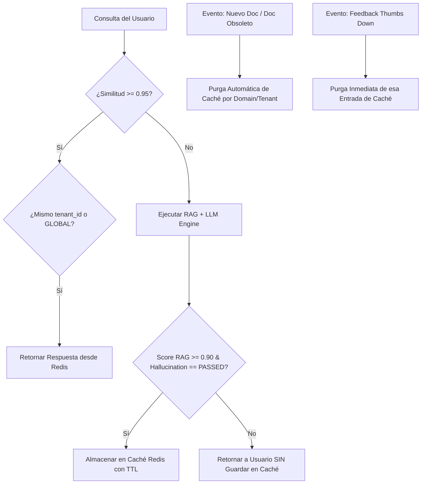

# 📜 SPEC: Semantic Cache, Async Queues & Cache Governance
**ID:** SPEC-CORE-04  
**Épica Relacionada:** Épica 9 (HU 9.1, HU 9.2) & Gobernanza de Caché  
**Estado:** PROPOSED / SPEC-DRIVEN  

---

## 1. Alcance
Especificaciones para la optimización de latencia y costo de API mediante caché semántico en Redis, delegación de tareas pesadas a colas Celery/RabbitMQ y **Gobernanza Estricta de Invalidación y Calidad de Caché**.

---

## 2. Parámetros de Caché Semántico

* **Vector Store de Caché:** Redis Index con distancia Cosine.
* **Umbral de Similitud ($\text{Similarity Threshold}$):** $0.95$ ($95\%$).
* **Estructura de Llave de Caché:** `cache:{tenant_id}:{domain}:{query_vector_hash}`
* **Scope del Caché:** Aislado estrictamente por `tenant_id` (Caché por tenant + Caché Global público).

---

## 3. Matriz de TTL (Time-To-Live) Diferencial por Dominio

| AI Pod / Dominio | Política de TTL | Justificación |
| :--- | :--- | :--- |
| **AFIP / ARCA & Normativas** | 24 Horas + Invalidación por Evento | Conocimiento regulatorio estable, purgado inmediatamente ante resoluciones nuevas. |
| **EvoCRM & Helpdesk** | 7 Días | Guías de configuración y capacitación sin cambios frecuentes. |
| **Odoo Social Marketing** | 48 Horas | Troubleshooting de APIs y permisos Meta/Instagram. |
| **Cadena de Suministros (SCM)**| 24 Horas | Reglas de rutas WMS y BoM MRP. |
| **Finanzas & Balances** | **Caché Deshabilitado (TTL 0)** | Información financiera dinámica específica de cada usuario. |

---

## 4. Escenarios de Comportamiento (BDD)

### Escenario 1: Impacto en Caché Semántico (Cache Hit)
```gherkin
Given que la pregunta "pasos para crear certificado AFIP" fue consultada previamente y guardada en caché
When un usuario del mismo tenant pregunta "¿cuáles son los pasos para generar el certificado de AFIP?"
And la similitud vectorial entre los embeddings de ambas preguntas es 0.97 (>= 0.95)
Then el sistema debe responder directamente desde Redis en < 100ms
And NO se debe realizar ninguna llamada a la API del LLM (0 costo de tokens)
And la respuesta debe marcar "cached": true
```

### Escenario 2: Procesamiento Asíncrono de Balances Extensos
```gherkin
Given un usuario subiendo un archivo PDF de balance con más de 30 páginas
When se solicita la asistencia financiera mensual
Then el API Gateway debe delegar el procesamiento a la cola de RabbitMQ
And retornar inmediatamente una respuesta HTTP 202 Accepted con un task_id
And el worker de Celery debe procesar el documento en segundo plano sin bloquear el sistema
```

---

## 5. Gobernanza del Caché de Respuestas (Cache Governance & Anti-Poisoning)

Para prevenir la propagación de respuestas obsoletas o erróneas en el caché semántico, se imponen las siguientes **4 Reglas de Gobernanza**:



### Regla 5.1: Invalidación Dirigida por Eventos (Knowledge-Driven Invalidation)
* Cuando un documento sube de versión o se marca como `OBSOLETE` (vía Data CI/CD):
  - El sistema emite un evento Redis Pub/Sub: `EVENT_DOC_INVALIDATED`.
  - El servicio de caché ejecuta un borrado de llaves por patrón: `DEL cache:{tenant_id}:{domain}:*`.
  - **Resultado:** Ningún usuario recibe respuestas basadas en documentación vetada u obsoleta.

### Regla 5.2: Control de Calidad Pre-Caché (Anti-Poisoning Quality Gate)
* Una respuesta generada por el motor RAG **SOLO** se guarda en la memoria caché si cumple dos condiciones:
  1. $\text{RAG Confidence Score} \ge 0.90$.
  2. $\text{Hallucination Gate Check} == \text{PASSED}$.
* **Resultado:** Previene el "Cache Poisoning" (contaminación del caché con respuestas alucinadas).

### Regla 5.3: Invalidación Reactiva por Feedback Negativo
* Si un usuario califica una respuesta con "Thumbs Down" (👎):
  - La clave vectorial exacta asociada a esa respuesta se **elimina inmediatamente** de Redis.
  - Se registra el evento en el log de auditoría para revisión de los consultores Senior.

### Regla 5.4: Aislamiento Estricto por Tenant
* Ninguna entrada de caché generada con un `tenant_id` privado puede ser recuperada por una consulta iniciada por otro `tenant_id`.
