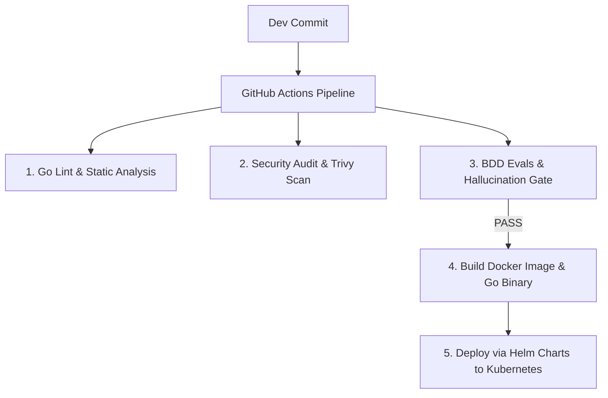

# 📜 SPEC: Parámetros de Arquitectura Empresarial (AuthN/AuthZ, Observabilidad, Disaster Recovery, FinOps & DevOps)
**ID:** SPEC-CORE-07  
**Épica Relacionada:** Gobernanza Empresarial, Seguridad & Producción  
**Estado:** PROPOSED / SPEC-DRIVEN  

---

## 1. Visión y Objetivos

Esta especificación establece las 5 dimensiones fundamentales de infraestructura y gobernanza operacional para garantizar que la plataforma sea **auditable**, **altamente disponible (99.99%)**, **resistente a desastres** y **lista para certificaciones SOC2 Type II e ISO 27001**.

---

## 2. Autenticación, Autorización & Control de Acceso (AuthN / AuthZ / RBAC)

### 2.1 Estándar de Identidad & JWT Schema
* **Protocolo:** OAuth 2.0 / OpenID Connect (OIDC).
* **Firma de Tokens:** Asimétrica utilizando **RS256** (RSA Signature con SHA-256).

```json
{
  "iss": "https://auth.aipods-consulting.com",
  "sub": "user_usr_998877",
  "aud": "aipods-api-gateway",
  "exp": 1784851200,
  "iat": 1784815200,
  "tenant_id": "tenant_empresa_acme",
  "roles": ["TenantAdmin"],
  "allowed_domains": ["AFIP", "SCM", "CRM"],
  "scope": "read write chat"
}
```

### 2.2 Roles & Matriz de Permisos (RBAC/ABAC)

| Rol | Permiso Chat / RAG | Gestión Documentos | Invalidación Caché | Configuración Tenant |
| :--- | :---: | :---: | :---: | :---: |
| **SuperAdmin** | ✅ (Todos) | ✅ (Global + Tenant) | ✅ (Global) | ✅ (Todos) |
| **SeniorConsultantAdmin** | ✅ (Todos) | ✅ (Global) | ✅ (Global) | ❌ |
| **TenantAdmin** | ✅ (Propio) | ✅ (Propio) | ✅ (Propio) | ✅ (Propio) |
| **TenantUser** | ✅ (Propio) | ❌ (Solo Lectura) | ❌ | ❌ |
| **PodPluginService** | ✅ (Conectores API) | ❌ | ❌ | ❌ |

---

## 3. Observabilidad, Telemetría & Audit Trail

### 3.1 Trazabilidad Distribuida (OpenTelemetry)
Todas las solicitudes reciben un encabezado `X-Trace-ID` (W3C Trace Context) propago a través de todo el flujo:

$$\text{Client} \xrightarrow{\text{Trace-ID}} \text{Go Gateway} \xrightarrow{\text{Trace-ID}} \text{Redis} \xrightarrow{\text{Trace-ID}} \text{Qdrant} \xrightarrow{\text{Trace-ID}} \text{LLM API}$$

### 3.2 Registro de Auditoría Inmutable (Audit Trail Schema)
Toda interacción en el sistema inserta de forma síncrona/asíncrona un registro en PostgreSQL / S3 Append-Only:

```sql
CREATE TABLE audit_logs (
    id UUID PRIMARY KEY DEFAULT gen_random_uuid(),
    trace_id VARCHAR(64) NOT NULL,
    tenant_id VARCHAR(64) NOT NULL,
    user_id VARCHAR(64) NOT NULL,
    routed_pod VARCHAR(50) NOT NULL,
    prompt_hash VARCHAR(64) NOT NULL,
    tokens_prompt INT NOT NULL,
    tokens_completion INT NOT NULL,
    cost_usd NUMERIC(10,6) NOT NULL,
    citations_json JSONB NOT NULL,
    created_at TIMESTAMP WITH TIME ZONE DEFAULT CURRENT_TIMESTAMP
);

CREATE INDEX idx_audit_tenant_time ON audit_logs(tenant_id, created_at);
```

---

## 4. Plan de Continuidad del Negocio & Disaster Recovery (DRP)

### 4.1 Métricas de Resiliencia Objetivo
* **RPO (Recovery Point Objective):** $< 1 \text{ minuto}$ (Pérdida máxima tolerable de datos).
* **RTO (Recovery Time Objective):** $< 5 \text{ minutos}$ (Tiempo máximo de restauración del servicio ante fallo total de un Data Center/Región).

### 4.2 Estrategia de Backup Inmutable (WORM)
* **Snapshots de Base Relacional (PostgreSQL):** Backups diarios completos + WAL Archiving continuo para Point-In-Time-Recovery (PITR) de hasta 35 días.
* **Snapshots Vectoriales (Qdrant):** Snapshots de colecciones guardadas en Buckets S3 con **Object Lock (WORM - Write Once Read Many)** habilitado para evitar borrado por Ransomware o acceso no autorizado.

---

## 5. FinOps, Control de Costos & Metered Billing

### 5.1 Rate Limiting por Tenant (Token Bucket Algorithm)
Implementado en Redis para controlar peticiones por minuto (RPM) y tokens por minuto (TPM):

```text
Limit = MIN(Plan_Max_RPM, Redis_Token_Bucket_Count)
```

### 5.2 Medición de Consumo en Tiempo Real (Metered Billing)
El Gateway registra en tiempo real el consumo exacto de tokens por modelo para cada tenant, permitiendo:
* Generación de alertas cuando un tenant alcanza el 80% y 95% de su plan mensual.
* Bloqueo progresivo o cobro por exceso (*Overage billing*).

---

## 6. Estrategia DevOps, IaC & CI/CD Pipeline



### 6.1 Infraestructura como Código (IaC)
* **Herramientas:** **Terraform / OpenTofu**.
* **Módulos:** Aprovisionamiento automático de clústeres Kubernetes (EKS/GKE), PostgreSQL Aurora, Qdrant Cloud y Redis Enterprise.

### 6.2 Escaneo de Seguridad & CI/CD Gate
Ninguna imagen de contenedor se despliega a producción si:
1. `golangci-lint` detecta advertencias de código o memory leaks.
2. `Trivy` o `Snyk` encuentran vulnerabilidades críticas (Severity: CRITICAL).
3. La suite de BDD Evals reporta alucinaciones en los Golden Datasets.
