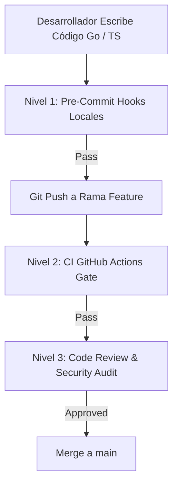

# 📜 SPEC: Código Limpio, Seguridad y Linters Automatizados (Clean Code & Security Linting)
**ID:** SPEC-CORE-08  
**Épica Relacionada:** Gobernanza de Código, Seguridad Frontend & CI/CD Gate  
**Estado:** PROPOSED / SPEC-DRIVEN  

---

## 1. Visión y Objetivos

Esta especificación define el estándar de **Código Limpio (Clean Code)**, análisis estático de seguridad y los linters automatizados requeridos para garantizar que todo el código fuente del proyecto (**Backend en Go**, **Frontend en React/TypeScript**, **Terraform** y **Dockerfiles**) sea **auditable**, **legible**, **seguro frente a inyecciones (SQLi, XSS)** y libre de deuda técnica.

---

## 2. Herramientas de Linting & Análisis Estático de Seguridad

### 2.1 Backend Core (Go 1.22+) - `golangci-lint`

El desarrollo en Go utilizará **`golangci-lint`** configurado con los siguientes módulos activos obligatorios:

| Linter / Módulo | Función de Seguridad & Calidad | Regla de Bloqueo |
| :--- | :--- | :--- |
| **`gosec`** | Detecta inyecciones SQL, hardcoded secrets, uso de criptografía débil (`md5`/`sha1`), permisos de archivo peligrosos y memory leaks. | **ERROR (Cero tolerancias)** |
| **`errcheck`** | Verifica que TODO error retornado por una función en Go sea capturado y manejado explícitamente (`if err != nil`). | **ERROR** |
| **`govet`** | Examina el código en busca de errores sospechosos (copia ineficiente de mutexes, formateo de printf, etc.). | **ERROR** |
| **`staticcheck`** | Análisis estático avanzado para simplificación de expresiones y detección de código inalcanzable. | **WARN / ERROR** |
| **`revive` & `stylecheck`** | Enforza el estilo idiomático de Go (nombres de variables concisos, exportación correcta de structs/métodos). | **WARN** |
| **`goconst` & `dupl`** | Evita la repetición de cadenas mágicas y código duplicado. | **WARN** |

---

### 2.2 Frontend Core (React 18 + TypeScript + Vite)

El desarrollo del Frontend (Portal de Clientes y Portal de Administración) implementa linters y herramientas de seguridad estrictas:

| Herramienta Frontend | Función de Calidad & Seguridad | Regla de Bloqueo |
| :--- | :--- | :--- |
| **`ESLint` + `@typescript-eslint`** | Enforza **Tipado Estricto (Strict Mode)**. Prohíbe el tipo `any` y evita `null pointer` / `undefined` crashes en producción. | **ERROR (Bloqueante)** |
| **`eslint-plugin-security`** | **Protección Anti-XSS & Injection:** Bloquea `dangerouslySetInnerHTML`, `eval()`, prototype pollution y expresiones regulares vulnerables a ReDoS. | **ERROR (Bloqueante)** |
| **`eslint-plugin-react-hooks`** | Enforza las reglas de React Hooks (`useEffect`, `useCallback`, `useMemo`) previniendo memory leaks y re-renders infinitos. | **ERROR** |
| **`DOMPurify`** | Sanitización obligatoria de todo HTML/Markdown formateado devuelto por los AI Pods antes de renderizarlo en el chat. | **Mandatorio por Arquitectura** |
| **`npm audit` / `socket.dev`** | Escaneo automático de dependencias en `node_modules` en busca de vulnerabilidades de cadena de suministro (Supply Chain). | **ERROR en Vulnerabilidades High/Critical** |
| **`Prettier`** | Formateo estandarizado de sintaxis en pre-commit. | **Auto-fix** |

---

### 2.3 Seguridad de la Cadena de Suministro (Supply Chain & Secret Prevention)

* **`gitleaks`:** Herramienta ejecutada en pre-commit y CI para prevenir la subida accidental de llaves privadas, API Keys de OpenAI/Anthropic/AWS o tokens JWT al repositorio.
* **`Trivy` (Aqua Security):** Escaneo de imágenes de contenedores Docker y dependencias `go.mod` / `package.json` en busca de vulnerabilidades clasificadas como `CRITICAL` o `HIGH`.

---

## 3. Proceso de Enforzamiento en 3 Niveles (3-Tier Quality Gate)

### Nivel 1: Hook Pre-Commit Local (`.pre-commit-config.yaml`)
Antes de permitir un `git commit`, la máquina local del desarrollador ejecuta automáticamente:
1. `gitleaks protect --staged` (Bloquea si hay claves/secretos en Go o TypeScript).
2. `gofmt -s -w` / `prettier --write` (Formateo automático).
3. `golangci-lint run --fast` (Go) & `npm run lint` (TypeScript).

### Nivel 2: Gate de Integración Continua (CI Pipeline en GitHub)
Todo Pull Request a la rama `main` ejecuta el pipeline automatizado. **El Merge se bloquea si:**
* `golangci-lint` o `ESLint` encuentran errores de seguridad o violaciones de tipos.
* Cobertura de pruebas unitarias en Go y React es **inferior al 80%**.
* `Trivy` o `npm audit` encuentran vulnerabilidades críticas en dependencias.

### Nivel 3: Guías de Código Limpio para Frontend React
1. **Desacoplamiento vía Custom Hooks:** La comunicación con el API Gateway en Go y el estado de los AI Pods debe residir en Custom Hooks (`useAIPodChat()`, `useRAGSearch()`).
2. **Manejo de Errores con Error Boundaries:** Todos los paneles del chat y tableros de administración deben envolverse en React Error Boundaries para evitar que un error aísle o rompa toda la aplicación.
3. **Manejo Seguro de Tokens:** Prohibido guardar JWT con permisos administrativos en `localStorage` accesible por scripts XSS.
