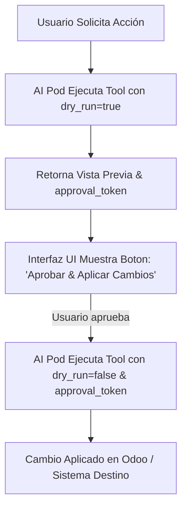

# 📜 SPEC: Protocolo Obligatorio de Simulación Dry-Run & Aprobación Humana
**ID:** SPEC-CORE-14  
**Épica Relacionada:** Gobernanza de Herramientas, Seguridad Operacional & Human-in-the-Loop  
**Estado:** PROPOSED / SPEC-DRIVEN  

---

## 1. Visión y Objetivos

Esta especificación establece la **obligatoriedad del patrón Dry-Run (Simulación de Ejecución)** para todas las herramientas (*Tools / Function Calling*) de los AI Pods que generen comandos, modifiquen datos o realicen llamadas con efectos secundarios (*Side Effects*) en Odoo, EvoCRM, SAP o sistemas externos.

Garantiza que ningún AI Pod ejecute un cambio destructivo o envíe un payload sin que el usuario humano haya revisado y aprobado una **vista previa exacta de la simulación**.

---

## 2. Contrato Mandatorio de Herramientas (`dry_run = true`)

Todo desarrollador (interno o externo) que cree una Tool para un AI Pod **DEBE** incluir el parámetro `dry_run` en el JSON Schema de la herramienta con valor por defecto `true`.

### 2.1 JSON Schema Estándar para Tools con Efectos Secundarios

```json
{
  "name": "prorratear_landed_costs",
  "description": "Calcula e imputa gastos de flete en compras de Odoo.",
  "parameters": {
    "type": "object",
    "properties": {
      "picking_id": { "type": "string" },
      "freight_amount": { "type": "number" },
      "dry_run": {
        "type": "boolean",
        "default": true,
        "description": "MANDATORIO: Si es true, simula el cálculo y retorna una vista previa sin modificar Odoo."
      }
    },
    "required": ["picking_id", "freight_amount", "dry_run"]
  }
}
```

---

## 3. Estructura de Respuesta del Dry-Run (`DryRunResult`)

Cuando `dry_run == true`, la herramienta NO modifica el sistema de destino y responde con el esquema estructurado `DryRunResult`:

```json
{
  "is_dry_run": true,
  "action_name": "prorratear_landed_costs",
  "summary": "Simulación exitosa del prorrateo de flete de $500 USD sobre 1,000 unidades.",
  "affected_records_count": 4,
  "changes_preview": [
    {
      "product_code": "PROD_001",
      "old_cost": 10.00,
      "new_cost": 10.50,
      "currency": "USD"
    }
  ],
  "requires_human_approval": true,
  "approval_token": "dryrun_tok_998877a6b5"
}
```

---

## 4. Flujo de Confirmación Humana (Human-in-the-Loop Flow)



1. **Paso 1 (Simulación):** El AI Pod responde mostrando los cambios propuestos en la vista previa del Dry-Run y genera un `approval_token` único firmado con fecha de expiración (5 minutos).
2. **Paso 2 (Confirmación):** El usuario revisa los números en la interfaz y hace clic en *"Aprobar y Ejecutar en Odoo"*.
3. **Paso 3 (Ejecución Real):** Se envía la petición enviando `dry_run = false` junto con el `approval_token` validado.

---

## 5. Enforzamiento en CLI (`aipod-cli validate`) y Code Review

El validador oficial de plugins **`aipod-cli validate`** rechazará cualquier AI Pod si:
* Define una herramienta que realiza mutaciones de datos sin incluir la propiedad `dry_run` en su esquema.
* No pasa la prueba unitaria de simulación Dry-Run en la suite de BDD.

---

## 6. Escenario BDD de Simulación Dry-Run

```gherkin
Given un usuario solicitando "Genera la orden de reabastecimiento para el producto P-100"
When el AI Pod procesa la solicitud
Then el Pod DEBE invocar la herramienta con el parámetro dry_run=true
And retornar la vista previa del cálculo sin crear la orden en Odoo
And incluir el token de aprobación "approval_token" solicitando la confirmación explícita del usuario
```
