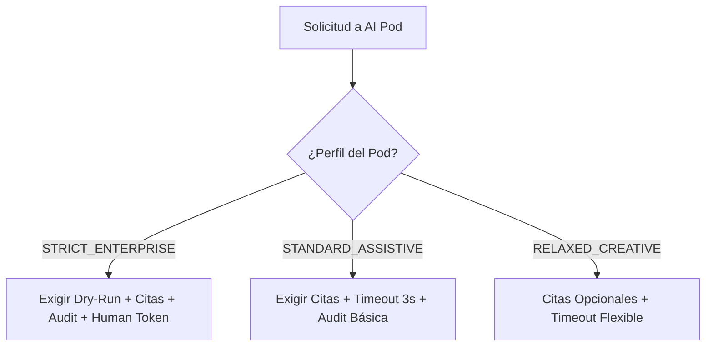

# 📜 SPEC: Estándares de Implementación de Pods & Gobernanza Adaptativa de Políticas
**ID:** SPEC-CORE-15  
**Épica Relacionada:** Gobernanza de Pods, Calidad Operacional & Perfiles de Política  
**Estado:** PROPOSED / SPEC-DRIVEN  

---

## 1. Visión y Objetivos

Esta especificación establece la suite completa de **Estándares de Implementación de AI Pods** y el marco de **Gobernanza Adaptativa de Políticas**, permitiendo exigir reglas estrictas de seguridad en dominios críticos (AFIP, Finanzas, WMS) mientras se otorga flexibilidad en dominios asistenciales o creativos (Marketing, Onboarding).

---

## 2. Suite de Estándares para AI Pods

Todo AI Pod desplegado en la plataforma puede estar sujeto a 4 Estándares de Calidad e Implementación:

| Estándar de Pod | Descripción & Exigencia | Invariante de Calidad |
| :--- | :--- | :--- |
| **1. Protocolo Dry-Run** | Simulación obligatoria previa de acciones con efectos secundarios y generación de token de aprobación humana. | Previene mutaciones accidentales en Odoo/EvoCRM/SAP. |
| **2. Citas de Fuente Obligatorias (Grounding)** | La respuesta DEBE incluir la lista explícita de citas textuales con número de página y archivo fuente RAG. | Elimina alucinaciones en respuestas legales/fiscales. |
| **3. Límite de Tiempo (Timeout 3s)** | La ejecución total de las herramientas del Pod no debe superar los 3,000 ms. | Garantiza latencia interactiva en la interfaz de chat. |
| **4. Log de Auditoría Completo (Audit Trail)** | Registro inmutable de parámetros de entrada, tiempo de ejecución y payload devuelto por la herramienta. | Requisito para auditorías de seguridad SOC2/ISO 27001. |

---

## 3. Matriz de Casos de Negocio (Strict vs Relaxed Enforcement)

No todos los dominios de negocio requieren la misma rigidez. La plataforma clasifica los Pods en 3 perfiles de exigencia:



### Matriz de Aplicación por Pod:

| AI Pod / Dominio | Perfil de Política | Dry-Run Required | Citations Required | Audit Level | Human Approval |
| :--- | :--- | :---: | :---: | :---: | :---: |
| **Pod AFIP / ARCA & Finanzas** | `STRICT_ENTERPRISE` | ✅ Sí | ✅ Sí | FULL_PAYLOAD | ✅ Sí |
| **Pod Cadena de Suministros (SCM)** | `STRICT_ENTERPRISE` | ✅ Sí | ✅ Sí | FULL_PAYLOAD | ✅ Sí |
| **Pod EvoCRM & Helpdesk** | `STANDARD_ASSISTIVE` | ✅ Sí (Mensajes) | ✅ Sí | BASIC | ✅ Sí |
| **Pod Odoo Social Marketing** | `RELAXED_CREATIVE` | ❌ No | ❌ Opcional | BASIC | ❌ No |
| **Pod Capacitación & Onboarding** | `STANDARD_ASSISTIVE` | ❌ No | ✅ Sí | BASIC | ❌ No |

---

## 4. Gestión Declarativa de Políticas (`pod_manifest.json`)

Para evitar hardcodear código en cada Pod, las políticas se declaran formalmente en el manifiesto del Pod y son enforzadas por el Gateway en Go:

```json
{
  "pod_id": "POD_AFIP_FINANCE",
  "name": "AI Pod AFIP y Finanzas",
  "version": "1.0.0",
  "policy_profile": "STRICT_ENTERPRISE",
  "enforced_policies": {
    "dry_run_required": true,
    "citations_required": true,
    "max_execution_timeout_ms": 3000,
    "audit_level": "FULL_PAYLOAD",
    "require_human_confirmation": true
  }
}
```

---

## 5. Enforzamiento en CLI (`aipod-cli validate`)

La herramienta CLI valida que el plugin cumpla estrictamente con las reglas de su `policy_profile`:

```bash
# El comando validate verifica si el perfil STRICT_ENTERPRISE cumple con los 4 estándares
aipod-cli validate . --profile=STRICT_ENTERPRISE
```

---

## 6. Escenario BDD de Gobernanza Adaptativa de Políticas

```gherkin
Given un Pod con perfil "STRICT_ENTERPRISE" (Pod AFIP)
When genera una respuesta a una consulta sobre certificados AFIP
Then el Gateway de Go DEBE verificar que la respuesta contenga citas RAG explícitas
And DEBE verificar que las Tools hayan ejecutado en modo dry_run=true
And si cualquiera de las dos verificaciones falla, la respuesta se bloquea con HTTP 422 Unprocessable Entity
```
