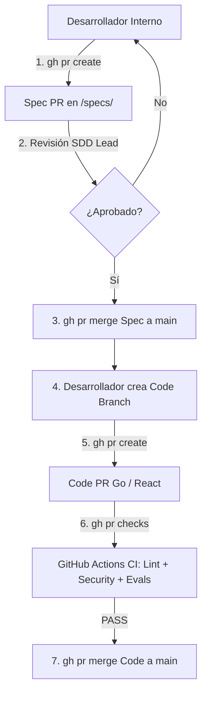

# 📜 SPEC: Gobernanza con GitHub CLI (`gh`), Flujo de Spec PRs y Diferenciación de Pods Internos vs Externos
**ID:** SPEC-CORE-19  
**Épica Relacionada:** Gobernanza de Código, GitHub Branch Protection, CI/CD Gates & Ecosistema Dual de Pods  
**Estado:** PROPOSED / SPEC-DRIVEN  

---

## 1. Visión y Objetivos

Esta especificación establece la gobernanza operacional del código fuente mediante el uso obligatorio de **GitHub CLI (`gh`)** para el equipo interno, la política de **Spec PRs como compuerta previa al código** y la **diferenciación estricta de gobernanza entre Pods Internos (Core Team) y Pods Externos (Clientes)**.

---

## 2. Uso Obligatorio de GitHub CLI (`gh`) para el Equipo Interno

Para los 3 desarrolladores internos del núcleo (Core, API Gateway en Go, Frontends y AI Pods Nativos), el uso de **GitHub CLI (`gh`)** es obligatorio para gestionar el ciclo de desarrollo desde la terminal:

```bash
# 1. Crear rama de especificación
git checkout -b spec/feature-nuevo-pod

# 2. Crear Pull Request de Especificación usando gh CLI
gh pr create --title "[SPEC] Add spec for feature X" --body "Spec preview for review" --base main

# 3. Monitorear el estado de GitHub Actions CI
gh pr checks

# 4. Hacer merge de la Spec una vez aprobada
gh pr merge --squash --delete-branch
```

---

## 3. Compuerta Estricta: Spec PR Pre-Code Gate & Branch Protection

### 3.1 Regla del Spec PR Previo
* **Prohibido Push Directo:** La rama `main` en GitHub tiene activadas **Branch Protection Rules**. Nadie (incluyendo administradores) puede hacer `git push origin main` directamente.
* **Secuencia Obligatoria de PRs:**
  1. **Fase A (Spec PR):** Se crea un PR modificando únicamente archivos dentro de `/specs/`. Se requiere la aprobación explícita del SDD Lead.
  2. **Fase B (Code PR):** Solo tras haberse integrado la Spec a `main`, el desarrollador abre el PR de código Go/React referenciando la Spec aprobada.



---

## 4. Gobernanza Dual: Pods Internos vs Pods Externos de Clientes

Para mantener el control del proyecto y la seguridad multi-tenant sin limitar la libertad de los clientes:

```text
+-----------------------------------------------------------------------------------+
| 1. AI PODS INTERNOS (Equipo Core):                                                |
|    - Desarrollados en el repositorio principal en Go.                             |
|    - Gobernados por Spec PRs con `gh` CLI y Branch Protection en GitHub.          |
|                                                                                   |
| 2. AI PODS EXTERNOS (Clientes / Desarrolladores de Terceros):                     |
|    - Desarrollados en repositorios independientes usando `aipod-cli`.              |
|    - NO tienen permisos de escritura ni acceso a GitHub `main`.                  |
|    - Sometidos vía API (/api/v1/admin/plugins/submit) a un Sandbox Aislado.        |
+-----------------------------------------------------------------------------------+
```

### 4.1 Proceso de Aprobación de Pods Externos (Client AI Pods Pipeline)
1. El cliente o desarrollador externo crea su Pod usando `aipod-cli init` en su propio entorno.
2. Sube el paquete comprimido del Pod a través del **Developer Portal / API Endpoint**: `POST /api/v1/admin/plugins/submit`.
3. El motor en Go ejecuta un **Worker de Verificación en Sandbox Efímero**:
   - Escaneo `gosec` y `gitleaks` sobre el código del plugin.
   - Ejecución de Evals contra datos de prueba aislados.
   - Verificación de que respete el parámetro `dry_run = true` y no omita el filtro `tenant_id`.
4. Si el Sandbox aprueba la verificación, el Pod pasa a estado `AVAILABLE_IN_MARKETPLACE` sin tocar el repositorio Git principal.

---

## 5. Persistencia en Skills & Rules (`.aipods/`)

Para que los asistentes de IA (Antigravity, Cursor, etc.) obedezcan esta gobernanza automáticamente, se crean las reglas estáticas en `.aipods/`:

### 5.1 Regla Git Workflow (`.aipods/rules/github_workflow.md`)
```markdown
# GitHub CLI & Spec PR Rules

1. NUNCA sugieras o ejecutes `git push origin main`.
2. Para proponer un cambio, DEBES usar `gh pr create` en una rama `spec/...` o `feat/...`.
3. Todo PR de código DEBE citar la especificación aprobada previamente en `/specs/`.
```

---

## 6. Escenario BDD de Gobernanza GitHub CLI

```gherkin
Given un desarrollador interno intentando hacer `git push origin main` con nuevo código en Go
When ejecuta el comando de push
Then GitHub debe rechazar la transacción por Branch Protection Rule
And el desarrollador debe utilizar `gh pr create` para abrir un Spec PR primero
And requerir que el pipeline de GitHub Actions pase todas las comprobaciones (gh pr checks) antes del merge
```
