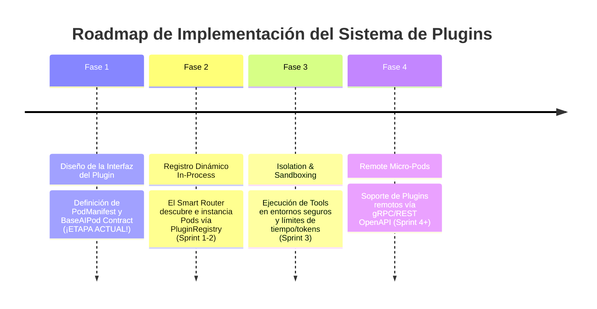

# 📜 SPEC: Plugin Architecture & Extensible AI Pods Framework
**ID:** SPEC-CORE-05  
**Épica Relacionada:** Épica 5 (Router) & Extensibilidad de Infraestructura  
**Estado:** PROPOSED / SPEC-DRIVEN  

---

## 1. Visión y Objetivos del Sistema de Plugins

El objetivo de esta especificación es permitir que la plataforma SaaS soporte la incorporación dinámica de **Nuevos AI Pods (Plugins)** desarrollados tanto por el equipo core como por terceros/integradores, sin modificar el código fuente del Router central ni del motor RAG.

---

## 2. Roadmap de Implementación por Etapas



### Etapa 1: Diseño de Contratos de Interfaz (Etapa Actual - Fase de Diseño)
* Se define el esquema `PodManifest` (`pod_manifest.json` / `pod_manifest.yaml`).
* Se establece la clase base abstracta `BaseAIPod` y los contratos BDD.

### Etapa 2: Registro Dinámico Core (Sprint 1 - Sprint 2)
* El Router se refactoriza para no hardcodear la lista de Pods, sino consultar el `PodRegistry`.
* Los Pods nativos (AFIP, EvoCRM, SCM) se implementan como plugins internos que cumplen con `BaseAIPod`.

### Etapa 3: Sandboxing & Gobernanza (Sprint 3)
* Enforzamiento de límites de latencia, cuota de tokens y sandbox de seguridad.

### Etapa 4: Micro-Pods Remotos (Sprint 4+)
* Capacidad de conectar Pods alojados fuera de la infraestructura principal vía conectores HTTP/gRPC.

---

## 3. Contrato de Interfaz del Plugin (`PodManifest` & `BaseAIPod`)

### 3.1 Esquema del Manifiesto (`pod_manifest.schema.json`)

Cada plugin debe incluir un manifiesto de configuración:

```json
{
  "$schema": "http://json-schema.org/draft-07/schema#",
  "type": "object",
  "properties": {
    "pod_id": { "type": "string", "pattern": "^[A-Z0-9_]+$" },
    "name": { "type": "string" },
    "version": { "type": "string", "pattern": "^\\d+\\.\\d+\\.\\d+$" },
    "min_core_version": { "type": "string" },
    "domain_tags": {
      "type": "array",
      "items": { "type": "string" }
    },
    "rag_namespace": { "type": "string" },
    "sandbox_level": { "type": "string", "enum": ["IN_PROCESS", "DOCKER_SANDBOX", "REMOTE_HTTP"] },
    "limits": {
      "type": "object",
      "properties": {
        "max_timeout_ms": { "type": "integer", "default": 3000 },
        "max_tokens_per_call": { "type": "integer", "default": 2048 }
      }
    }
  },
  "required": ["pod_id", "name", "version", "domain_tags", "rag_namespace"]
}
```

### 3.2 Protocolo/Interfaz Ejecutable (Python Abstract Class)

```python
from abc import ABC, abstractmethod
from typing import List, Dict, Any

class BaseAIPod(ABC):
    
    @abstractmethod
    def get_manifest(self) -> Dict[str, Any]:
        """Retorna la metadata del manifiesto del Pod."""
        pass
        
    @abstractmethod
    def evaluate_intent_confidence(self, query: str, context: Dict[str, Any]) -> float:
        """Devuelve un score entre 0.0 y 1.0 indicando qué tan apto es este Pod para la consulta."""
        pass

    @abstractmethod
    def get_system_prompt(self, tenant_id: str) -> str:
        """Genera el System Prompt inyectando reglas de dominio y contexto del tenant."""
        pass

    @abstractmethod
    def get_tools((self, tenant_id: str) -> List[Any]:
        """Retorna las herramientas (functions/tools) disponibles para este Pod."""
        pass
```

---

## 4. Limitaciones y Reglas de Gobernanza para Plugins

Para prevenir que la adición de un nuevo "AI Pod" afecte el rendimiento, la estabilidad o la seguridad multi-tenant del SaaS, se imponen las siguientes **4 Limitaciones Estrictas**:

| Área de Limitación | Regla / Restricción Implicada | Enforzamiento Térmico / Técnico |
| :--- | :--- | :--- |
| **1. Aislamiento Multi-Tenant** | El plugin **NUNCA** puede realizar consultas a la BD Vectorial sin aplicar el filtro `tenant_id == X OR tenant_id == 'GLOBAL'`. | **Strict Data Proxy:** Las llamadas RAG se efectúan exclusivamente a través del Core RAG Engine con inyección automática de metadatos. |
| **2. Límites de Latencia (Timeout)** | La ejecución total de un Pod (RAG + Prompting + Tool calls) no puede exceder los **3,000 ms**. | **Circuit Breaker & Fallback:** Si se superan los 3s, el Router aborta la llamada y responde con una respuesta de contingencia. |
| **3. Ejecución de Código (Sandboxing)** | Si un plugin incluye una herramienta de ejecución de código (ej. cálculo de fórmulas de producción en Python), **NO** puede ejecutarse en el proceso principal de FastAPI. | **Ephemeral Sandbox:** Debe correr dentro de un entorno aislado (WASM o contenedor Docker efímero con recursos limitados). |
| **4. Cuota de Tokens & Rate Limits** | Cada Pod Plugin consume de una bolsa de cuotas de Tokens Por Minuto (TPM) asignada. | **Token Bucket Middleware:** Rechazo de llamadas al plugin si sobrepasa la cuota configurada en Redis. |

---

## 5. Escenarios BDD de Validación del Sistema de Plugins

### Escenario 1: Descubrimiento y Registro Automático de Nuevo Pod
```gherkin
Given un archivo "pod_manifest.json" de un nuevo Pod "LEGAL_COMPLIANCE" en el directorio /plugins/
When el servicio API Gateway se inicia
Then el PluginRegistry debe cargar y validar el manifiesto del nuevo Pod
And el Smart Router debe incluir "LEGAL_COMPLIANCE" en la matriz de enrutamiento dinámico
```

### Escenario 2: Aislamiento por Timeout Excedido (Circuit Breaker)
```gherkin
Given un Plugin "CUSTOM_SCM" cuyo método de procesamiento demora 4500ms (superior al límite de 3000ms)
When el Smart Router deriva una consulta a "CUSTOM_SCM"
Then el monitor de ejecución debe cortar la llamada a los 3000ms
And retornar un error controlado sin afectar la disponibilidad del resto del SaaS
```
