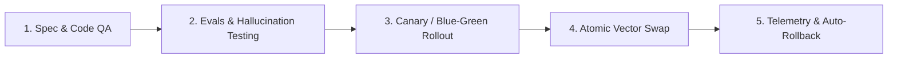

# 📜 SPEC: Ciclo de Vida, Gobernanza de Releases y Actualizaciones (Data & Plugin Governance)
**ID:** SPEC-CORE-06  
**Épica Relacionada:** Épica 10 (Data CI/CD) & Gobernanza de Plataforma  
**Estado:** PROPOSED / SPEC-DRIVEN  

---

## 1. Visión y Objetivos de Gobernanza

El objetivo de esta especificación es definir el ciclo de vida continuo de desarrollo, actualización y versión de software, AI Pods, system prompts y bases de conocimiento vectorial (RAG). Garantiza **cero alucinaciones o degradación del servicio**, **despliegues atómicos sin tiempo de inactividad** y **rollback automático** ante regresiones de respuestas.

---

## 2. Esquema de Versionado Tripartito (Triple Semantic Versioning)

Para evitar incompatibilidades entre el Core, los Pods/Plugins y la documentación o bases de datos vectoriales:

```text
+-----------------------------------------------------------------------+
|  1. CORE ENGINE VERSION    : vMAJOR.MINOR.PATCH (ej. v1.2.0)          |
|  2. POD / PLUGIN VERSION   : vMAJOR.MINOR.PATCH (ej. v1.0.1)          |
|  3. KNOWLEDGE CORPUS VER.  : DOMAIN-YYYY.Q/VER   (ej. AFIP-2026.3-v1)   |
+-----------------------------------------------------------------------+
```

### Reglas de Compatibilidad:
* **Breaking Changes en Core (v2.0.0):** Requieren migración y re-validación de todos los Pods/Plugins.
* **Compatibilidad Pod-Core:** Todo manifiesto de Pod declara `min_core_version` y `max_core_version`.

---

## 3. Ciclo de Vida de Releases (5-Stage Governance Pipeline)



### Fase 1: Spec & Static Validation
* Validación estática de esquemas JSON (`PodManifest`, `OpenAPI schema`, `Tool signatures`).
* Verificación de invariantes de seguridad multi-tenant.

### Fase 2: Suite de Evaluación Automatizada (Evals & Golden Datasets)
Antes de aprobar cualquier cambio en un Pod o en la Base de Conocimientos, la suite de CI/CD ejecuta un conjunto de consultas de prueba ("Golden Dataset") evaluando:

$$\text{RAG Accuracy Score} = \frac{\text{Respuestas Correctas con Citas Válidas}}{\text{Total de Consultas del Golden Dataset}} \ge 0.95$$

$$\text{Hallucination Rate} = \frac{\text{Afirmaciones sin sustento en el Contexto}}{\text{Total de Afirmaciones}} \le 0.01$$

### Fase 3: Despliegue Progresivo (Canary Deployment)
* El nuevo Pod/Plugin se activa en producción únicamente para un **5% de los tenants** (Grupo Canario).
* Se evalúa la satisfacción del usuario y métricas de error durante un período de prueba de 24 horas.

### Fase 4: Cambio Atómico de Conocimiento (Atomic Vector Index Swapping)
Para actualizar una norma o manual (ej. nueva resolución de AFIP) sin interrumpir el servicio:

1. Los nuevos vectores se indexan con estado `PROCESSING` y etiqueta de versión `v2`.
2. Una vez completadas las pruebas de la Fase 2, se ejecuta una transacción atómica en la BD Relacional y Vectorial:

```sql
-- Transacción Atómica de Actualización de Versión de Conocimiento
BEGIN;
UPDATE documents SET status = 'OBSOLETE' WHERE domain = 'AFIP' AND version = 1;
UPDATE documents SET status = 'ACTIVE' WHERE domain = 'AFIP' AND version = 2;
COMMIT;
```

3. El filtro dinámico RAG (`status == 'ACTIVE'`) conmuta instantáneamente al nuevo conocimiento sin reiniciar ningún servicio.

### Fase 5: Telemetría en Tiempo Real y Rollback Automático
El sistema monitorea de forma continua los siguientes indicadores:
* **Error Rate / Exception Rate:** $\ge 2.0\%$
* **User Feedback (Thumbs Down):** $\ge 5.0\%$
* **Latencia $P_{95}$:** $> 3500\text{ms}$

Si se viola cualquiera de estos umbrales dentro de las 4 horas posteriores a un release, el **Orquestador de Gobernanza** ejecuta un **Rollback Automático en $< 5\text{ segundos}$**:
- Invalida la versión canaria del Pod.
- Revierte la etiqueta `status` de la versión anterior de documentos a `ACTIVE`.

---

## 4. Escenarios BDD de Gobernanza y Releases

### Escenario 1: Bloqueo de Release por Regresión en Evals (Alucinaciones)
```gherkin
Given una actualización propuesta para el System Prompt del Pod "AFIP_FINANCE"
When el pipeline de CI/CD ejecuta la suite de Evals sobre el Golden Dataset de AFIP
And la tasa de alucinación (Hallucination Rate) resulta en 0.04 (> 0.01 permitido)
Then el pipeline DEBE abortar el despliegue automáticamente
And marcar el build como FAILED impidiendo su paso a Staging o Producción
```

### Escenario 2: Rollback Automático de Conocimiento en Producción
```gherkin
Given la versión 2.0 del documento "Normativa_SCM_2026.pdf" desplegada a producción
When la tasa de Thumbs Down de los usuarios para consultas de SCM supera el 5% en 1 hora
Then el Orquestador de Gobernanza debe activar el evento de Rollback
And cambiar atómicamente el estado de la versión 2.0 a "DISABLED"
And restaurar la versión 1.0 a estado "ACTIVE" en < 5 segundos
And enviar una alerta crítica al equipo de soporte Senior
```
