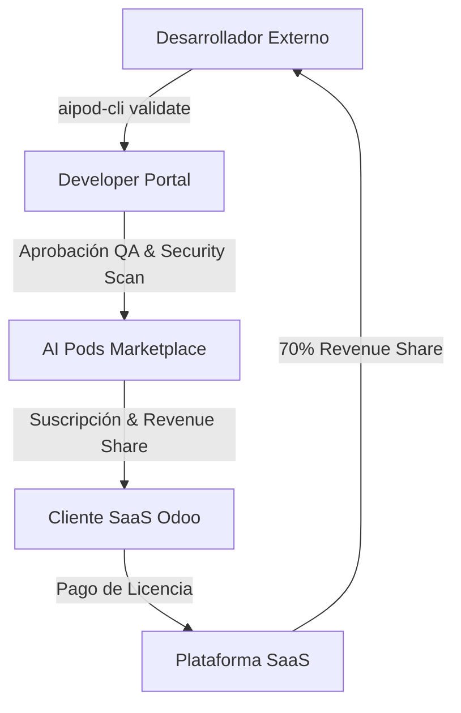

# 📜 SPEC: Roadmap Estratégico, Red-Teaming, Monetización & Marketplace de Pods
**ID:** SPEC-CORE-11  
**Épica Relacionada:** Estrategia de Producto, Seguridad IA & Modelo de Negocio SaaS  
**Estado:** PROPOSED / SPEC-DRIVEN  

---

## 1. Visión Estratégica de Producto

Con las bases técnicas, arquitectónicas y de seguridad totalmente consolidadas en Go, PostgreSQL 16 Enterprise, Qdrant y Redis Active-Active, la siguiente fase requiere hacer foco en **4 Pilares Estratégicos de Negocio y Seguridad de IA**:

---

## 2. Pilar 1: Framework de Red-Teaming & Pruebas Anti-Prompt-Injection

Dado que la plataforma estará expuesta a más de 200 empresas y clientes finales, es crítico prevenir ataques de ingeniería de prompts (*Prompt Injection Attacks*):

### 2.1 Amenazas a Evaluar Automatizadamente
* **Indirect Prompt Injection:** Intentos de usuarios de insertar texto malicioso en documentos subidos (PDFs) para forzar al RAG a ejecutar instrucciones arbitrarias.
* **Context Bleed Attack:** Intentos del usuario de engañar al LLM para que ignore las instrucciones del System Prompt y revele datos de otros `tenant_id`.
* **Jailbreak Attacks:** Intentos de hacer que el Pod ignore su dominio de especialidad (AFIP/Odoo) y actúe como una IA genérica o genere contenido no permitido.

### 2.2 Suite de Seguridad Anti-Inyección
* Validación previa de inputs mediante **Filtros de Sanitización de Prompts** en Go antes de llamar al LLM.
* Evaluación continua de resistencia a inyecciones en el pipeline de CI/CD.

---

## 3. Pilar 2: Motor de Monetización & Pricing SaaS (Metered Billing Engine)

Para garantizar la rentabilidad del SaaS y permitir modelos de negocio flexibles:

### 3.1 Modelos de Cobro Soportados
1. **Tier por Consumo de Tokens (Metered Billing):** Cobro transparente en base al volumen exacto de tokens consumidos por empresa (atribuido en `audit_logs`).
2. **Tier por AI Pods Habilitados:** Plan base que incluye el Pod AFIP, con cobro adicional por habilitar los Pods SCM, EvoCRM o plugins de terceros.
3. **Tier por Cantidad de Registros / Empresas Cliente:** Límites escalonados de almacenamiento vectorial por tenant.

### 3.2 Integración con Pasarelas de Pago
* Integración vía webhooks seguros con pasarelas de pago recurrentes (**Stripe Billing / Mercado Pago API**).

---

## 4. Pilar 3: Portal de Creadores & Marketplace de AI Pods

Para escalar el ecosistema de consultoría más allá del equipo interno:



* **Marketplace de Plugins:** Consultores senior de otros países podrán publicar sus propios Pods (ej. Pod de Localización Odoo Chile, Pod de Nómina México, Pod de Comercio Exterior).
* **Revenue Share Model:** Reparto transparente de ingresos entre los creadores de los Pods y la plataforma SaaS.

---

## 5. Pilar 4: Roadmap Ejecutivo de Despliegue (Phased Rollout)

```text
+-----------------------------------------------------------------------------------+
| SPRINT 1: MVP TÉCNICO CORE (Go Backend + PostgreSQL + Qdrant + Pod AFIP)          |
| SPRINT 2: SMART ROUTER & EXPANSIÓN (Pods EvoCRM, Social Marketing y SCM)          |
| SPRINT 3: GOBERNANZA AVANZADA (Caché Active-Active + Red-Teaming + Metered Billing)|
| SPRINT 4: MARKETPLACE DE PLUGINS & ECOSISTEMA DE DESARROLLADORES EXTERNOS         |
+-----------------------------------------------------------------------------------+
```
