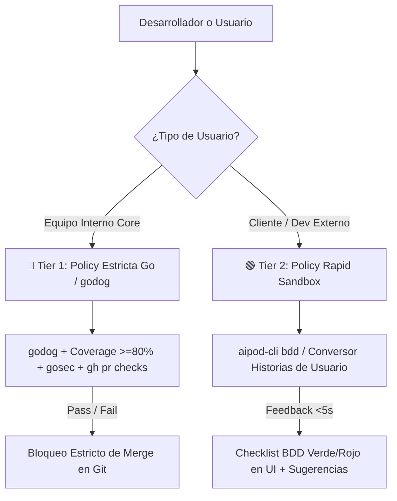
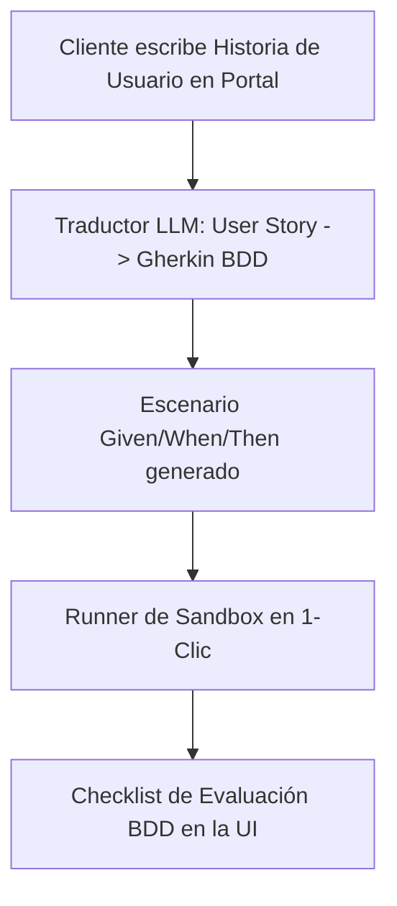

# 📜 SPEC: Automatización de Tests BDD en Go & Marco de Evaluaciones Diferenciadas (Tiered Evals)
**ID:** SPEC-CORE-20  
**Épica Relacionada:** Testing BDD Nativo en Go, Pruebas para Clientes & Conversión de Historias de Usuario  
**Estado:** PROPOSED / SPEC-DRIVEN  

---

## 1. Visión y Objetivos

Esta especificación establece la conexión directa entre los escenarios **BDD (`Given / When / Then`)** definidos en las especificaciones y la suite de pruebas ejecutables en **Go (`godog`)**, definiendo un esquema de **Políticas Diferenciadas de Testing** para separar el rigor exigido al equipo interno del dinamismo rápido requerido por los clientes.

---

## 2. Conexión de Escenarios BDD a Tests en Go (`godog` Framework)

En el backend en Go, las cláusulas BDD redactadas en los archivos `.spec.md` se conectan directamente a código ejecutable mediante el framework **`godog`** (Cucumber nativo en Go):

```go
// internal/testing/bdd_steps.go
package testing

import (
    "context"
    "github.com/cucumber/godog"
)

func RegisterBDDSteps(ctx *godog.ScenarioContext) {
    ctx.Step(`^un mensaje de usuario: "([^"]*)"$`, userSendMessage)
    ctx.Step(`^el Smart Router procesa la intención del mensaje$`, routerProcessIntent)
    ctx.Step(`^el arreglo target_pods debe contener "([^"]*)"$`, verifyTargetPod)
}
```

Al ejecutar `go test ./...` o `godog run`, Go valida que **todos los escenarios BDD de las especificaciones pasen al 100%** como parte del pipeline de CI/CD.

---

## 3. Políticas Diferenciadas de Testing: Equipo Interno vs Clientes



### Matriz de Diferenciación de Políticas:

| Dimensión de Pruebas | 🔴 Equipo Interno Core (Strict Policy) | 🟢 Clientes / Devs Externos (Rapid Sandbox) |
| :--- | :--- | :--- |
| **Framework de Pruebas** | **`godog` nativo en Go** ejecutado en `go test ./...` y GitHub Actions CI. | **`aipod-cli bdd`** y Runner de Evaluaciones HTTP en Sandbox. |
| **Cobertura & Security** | **Cobertura $\ge 80\%$** + Escaneo `gosec` + Zero Linter Warnings. | Cero exigencia de cobertura interna de código. |
| **Velocidad de Ejecución** | Pipeline completo en CI ($<3$ minutos). | Ejecución instantánea en Sandbox ($<5$ segundos). |
| **Gobernanza de Fallos** | **Bloqueo Total de Merge** en GitHub (`main`). | **Asistivo / Sugerencias:** Muestra recomendaciones para ajustar prompts o docs. |

---

## 4. Módulo Conversor: 'User Story a BDD Gherkin' para Clientes

Para que los clientes sin conocimientos técnicos de programación puedan redactar y probar la calidad de sus AI Pods:



1. **Entrada del Cliente:**  
   *"Quiero que mi AI Pod responda dudas sobre la política de vacaciones y si la pregunta es sobre sueldos me derive a RRHH"*.
2. **Traducción Automatizada a BDD:**  
   El motor en Go genera automáticamente la especificación BDD:
   ```gherkin
   Given un usuario consultando sobre "días de vacaciones acumulados"
   When el Pod procesa la duda
   Then debe responder citando la "Politica_Vacaciones.pdf"
   ```
3. **Ejecución en 1-Clic:**  
   El cliente presiona el botón **"Probar mi Historia de Usuario"** y ve un checklist verde/rojo validando la respuesta de su Pod en tiempo real.

---

## 5. Escenario BDD de Validación de Pruebas Diferenciadas

```gherkin
Given un cliente creando una nueva Historia de Usuario en el Portal de Clientes
When presiona el botón "Convertir a BDD y Probar"
Then el sistema debe generar los escenarios Given/When/Then en < 2 segundos
And ejecutar las pruebas en el Sandbox bajo la política Rapid Tier
And mostrar el resultado de cumplimiento sin requerir linters de Go ni pipeline de GitHub
```
