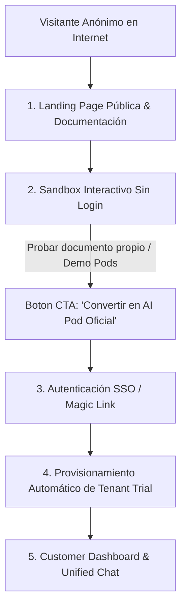

# 📜 SPEC: Portal Público de Clientes, Sandbox Interactivo & Dashboard Customer
**ID:** SPEC-CORE-12  
**Épica Relacionada:** Frontend de Clientes, Growth, Sandbox & Onboarding  
**Estado:** PROPOSED / SPEC-DRIVEN  

---

## 1. Visión y Objetivos

Esta especificación establece la arquitectura funcional y de experiencia de usuario (UX/UI) del **Portal Público de Clientes (`app.aipods-consulting.com`)**, combinando una estrategia de atracción de usuarios (*Growth Marketing*), un **Sandbox interactivo sin necesidad de login**, autenticación segura y el Dashboard post-login para la gestión del tenant.

---

## 2. Arquitectura de Experiencia de Usuario (Customer Journey)



---

## 3. Componentes del Portal Público (Pre-Login)

### 3.1 Landing Page de Crecimiento & Demostración de Virtudes
* **Hero Banner Interactivo:** Demostración animada del Smart Router derivando consultas a los Pods AFIP, EvoCRM y SCM en tiempo real.
* **Módulo de Virtudes del Sistema:**
  - **Cero Alucinaciones:** Citas textuales explícitas con número de página y archivo original.
  - **Multi-Tenant Certificado:** Garantía de privacidad estricta por metadatos.
  - **Conectores Nativos:** Logos e instrucciones de conexión con Odoo, EvoCRM (WhatsApp), SAP y Google Workspace.
* **Documentación Pública e Integraciones:** Seccion pública navegable con guías OpenAPI y código de integración en Odoo/Python/Go.

### 3.2 Sandbox / Playground Interactivo (Try-Before-Buy)
Para atraer y convertir posibles clientes sin fricción:
* **Prueba en Vivo de Pods Públicos:** El visitante puede chatear en tiempo real con una versión Sandbox del **Pod AFIP** y del **Pod SCM** pre-cargados.
* **Creador de AI Pods Sandbox ("Sube tu Documento y Prueba"):**
  1. El visitante arrastra un archivo PDF (ej. un manual interno de su empresa de hasta 5MB).
  2. El Sandbox procesa el documento en una sesión efímera aislada (`tenant_id = sandbox_session_uuid`).
  3. El visitante realiza 3 preguntas de prueba y ve cómo el AI Pod responde citando su propio documento.
  4. **Conversión CTA:** *"¿Te gustó el resultado? Crea tu cuenta gratis en 1 clic para guardar este AI Pod permanentemente"*.

---

## 4. Autenticación & Provisionamiento Auto-Servicio

* **Métodos de Login / Registro:**
  - Single Sign-On (SSO) con **Google Workspace** y **Microsoft Entra ID**.
  - **Magic Links por Email** (Passwordless login sin contraseñas).
* **Onboarding Automatizado:** Al completar el registro, el sistema en Go aprovisiona automáticamente un `tenant_id` en estado `TRIAL` (14 días gratis / 50,000 tokens) y migra los documentos creados en el Sandbox a su espacio privado.

---

## 5. Dashboard del Cliente (Post-Login)

Una vez autenticado, el usuario accede a su consola de gestión:

1. **Unified Chat Console:** Consola de chat interactiva conectada al Smart Router con soporte para streaming (SSE) y descarga de comandos/reportes.
2. **Knowledge Base Manager:** Interfaz para subir, actualizar y eliminar manuales y normativas privadas del tenant (con vista del estado `PROCESSING` $\rightarrow$ `ACTIVE`).
3. **Métricas de Consumo & API Keys:** Panel de FinOps para visualizar tokens consumidos, historial de auditoría y generación de API Keys para conectar su Odoo/EvoCRM.

---

## 6. Escenario BDD de Sandbox y Conversión de Cliente

```gherkin
Given un visitante no autenticado navegando en la Landing Page pública
When el visitante arrastra un documento PDF "Politica_Interna_Compras.pdf" al Sandbox
Then el sistema debe procesar el documento en un espacio de prueba aislado
And responder preguntas de prueba incluyendo la cita del PDF del visitante
And al hacer clic en "Guardar mi AI Pod", derivar al flujo de registro SSO
And asociar el documento "Politica_Interna_Compras.pdf" al nuevo tenant_id registrado
```
