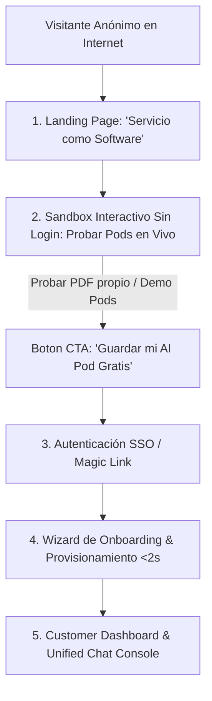

# 📜 SPEC: Portal Público de Clientes, Sandbox Interactivo, Marketing & Servicio como Software
**ID:** SPEC-CORE-12  
**Épica Relacionada:** Frontend de Clientes, Growth, Sandbox, Onboarding & Positioning  
**Estado:** PROPOSED / SPEC-DRIVEN  

---

## 1. Visión y Posicionamiento Estratégico

Esta especificación establece la arquitectura funcional y la propuesta de valor comercial del **Portal Público de Clientes (`app.aipods-consulting.com`)**, introduciendo el paradigma transformador de **"Servicio como Software" (Service-as-Software)**.

### 💡 El Cambio de Paradigma: De SaaS a "Servicio como Software"

* **SaaS Tradicional (Software como Servicio):** *"Te alquilo la herramienta para que tú hagas el trabajo"*. (Ej: Salesforce u Odoo clásico, donde pagas por el software pero tu equipo pone la mano de obra).
* **Servicio como Software (AI Pods Enterprise):** *"Te entrego el resultado final listo, porque nuestro software actúa como la fuerza laboral experta"*. (El conocimiento táctico de consultores Senior AFIP, Odoo, SAP y SCM queda empaquetado en AI Pods que ejecutan el trabajo por ti).

---

## 2. Elevator Pitch Oficial para la Landing Page

> *"Históricamente, el mercado vendió **Software como Servicio (SaaS)**: te daban la herramienta en la nube para que tus empleados hicieran el trabajo. Hoy, con **AI Pods Enterprise**, entregamos **Servicio como Software**: en lugar de darte la herramienta, te entregamos agentes de Inteligencia Artificial especializados que ejecutan el trabajo complejo por ti. Compras resultados inmediatos, no horas-hombre."*

---

## 3. Arquitectura de Experiencia de Usuario (Customer Journey)

---

## 4. Componentes del Portal Público & Copywriting de Landing Page

### 4.1 Hero Banner Interactivo (Service-as-Software Value)
* **Titular Principal:** *"Deje de Alquilar Herramientas. Empiece a Contratar Resultados con Servicio como Software."*
* **Sub-titular:** *"Despliegue AI Pods: Agentes autónomos especializados en AFIP, Odoo, SAP y SCM que ejecutan el trabajo de consultoría y soporte en segundos."*
* **Demostración en Vivo:** Simulación interactiva del Smart Router derivando consultas y mostrando el output completado con citas textuales.

### 4.2 Los 3 Pilares Comerciales de la Landing
1. **Compras Resultados, no Horas-Hombre:** Sin facturar horas/hombre por soporte o desarrollo. El AI Pod resuelve en segundos lo que a un humano le toma días.
2. **Conocimiento Senior Empaquetado:** Las mejores prácticas de AFIP, fiscalidad, Odoo y WMS pre-entrenadas y mantenidas por socios Seniors.
3. **Escalabilidad Instantánea:** Multiplica la capacidad operativa sin cuellos de botella de contratación ni curvas de aprendizaje.

---

## 5. Sandbox / Playground Interactivo (Try-Before-Buy)

* **Prueba en Vivo de Pods Públicos:** El visitante puede chatear en tiempo real con el **Pod AFIP**, **Pod SCM** y el **Pod DevOps GitHub/Odoo.sh**.
* **Creador de AI Pods Sandbox ("Sube tu PDF y Prueba"):**
  1. El visitante arrastra un archivo PDF (ej. un manual interno de su empresa de hasta 5MB).
  2. El Sandbox procesa el documento en una sesión efímera aislada (`tenant_id = sandbox_session_uuid`).
  3. El visitante realiza 3 preguntas de prueba y ve cómo el AI Pod responde citando su propio documento.
  4. **Conversión CTA:** *"¿Te gustó el resultado? Crea tu cuenta gratis en 1 clic para guardar este AI Pod permanentemente"*.
