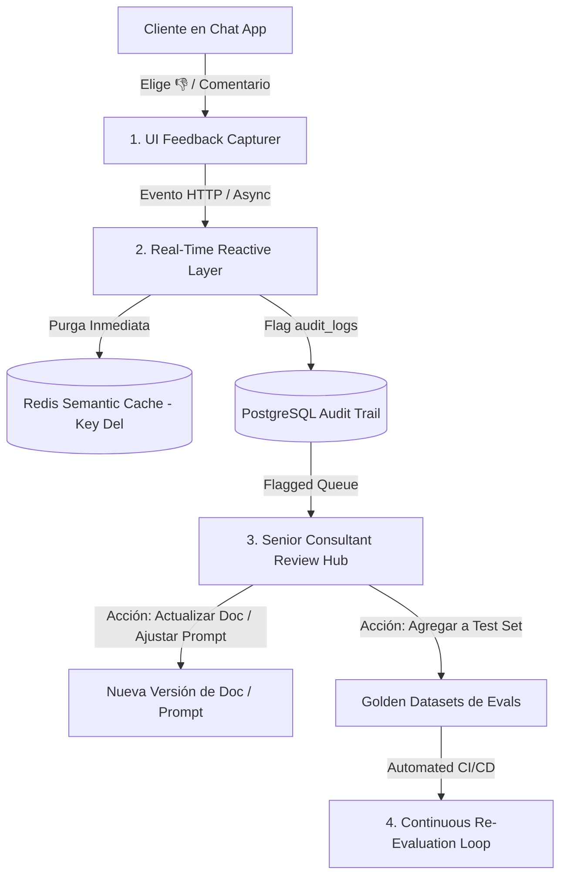

# 📜 SPEC: Sistema de Mejora Continua por Feedback de Usuarios & RLHF Pipeline
**ID:** SPEC-CORE-17  
**Épica Relacionada:** ISO 9001 (QMS), Mejora Continua & Calidad de Respuestas RAG  
**Estado:** PROPOSED / SPEC-DRIVEN  

---

## 1. Visión y Objetivos

Esta especificación establece el **Ciclo de Mejora Continua por Feedback de Usuario (PDCA Loop)**. Garantiza que la insatisfacción de un usuario active una reacción en tiempo real para proteger a otros clientes, y alimente de forma continua el corpus de conocimiento y los tests automatizados del proyecto.

---

## 2. Arquitectura del Pipeline de Mejora Continua (4 Capas)



---

## 3. Especificación de las 4 Capas del Pipeline

### 3.1 Capa 1: Captura de Feedback en la Interfaz (UI Capturer)
* **Feedback Explícito Binario:** Cada mensaje retornado por un AI Pod presenta botones 👍 (Thumbs Up) y 👎 (Thumbs Down).
* **Feedback Cualitativo Opcional:** Al marcar 👎, se despliega un micro-modal solicitando la causa:
  - `INACCURATE_INFORMATION`: Información incorrecta o norma desactualizada.
  - `WRONG_CITATION`: Cita de documento o página equivocada.
  - `BAD_FORMAT_OR_TONE`: Error de código, OpenSSL mal formateado o tono inapropiado.
* **Señales Implícitas (Implicit Feedback):**
  - Botón *"Copiar Comando/Código"*: Registra una señal positiva (+1) en la telemetría.
  - Re-pregunta inmediata sobre la misma duda: Registra una señal negativa (-1).

### 3.2 Capa 2: Reacción en Tiempo Real (Real-Time Reactive Layer)
Al recibir un evento de feedback negativo 👎:
1. **Purga Inmediata de Caché:** El motor en Go purga la clave vectorial exacta en Redis (`DEL cache:{tenant_id}:{domain}:{query_hash}`). **Resultado:** Ningún otro usuario volverá a recibir esa respuesta potencialmente defectuosa.
2. **Flag de Auditoría:** El registro en `audit_logs` actualiza `flagged_for_review = true` y dispara una notificación en la cola NATS.

### 3.3 Capa 3: Centro de Revisión de Consultores Senior (Admin Portal)
En el portal administrativo (`admin-internal.aipods.com`), los consultores Senior cuentan con la bandeja **Knowledge Improvement Hub**:
* **Bandeja de Respuestas Cuestionadas:** Lista ordenada de preguntas que recibieron 👎 con el contexto RAG original.
* **Acciones de Corrección en 1 Clic:**
  1. *Subir Nueva Versión del Documento:* Si la norma AFIP/Odoo cambió, se sube `doc_v2.pdf` desatando la conmutación atómica de vectores.
  2. *Agregar a Golden Dataset:* El par `(Pregunta, Respuesta_Corregida_por_Senior)` se convierte automáticamente en un caso de prueba ejecutable en la suite de Evals.
  3. *Ajustar System Prompt:* Si fue un fallo de formato, se refina el System Prompt del Pod.

### 3.4 Capa 4: Re-Evaluación Automatizada & Métrica CSAT
* **Pipeline de CI/CD:** Antes de permitir cualquier nuevo release, GitHub Actions ejecuta la suite de Evals incorporando todos los nuevos casos derivados de los feedbacks de los usuarios.
* **Métrica de Calidad ISO 9001 (CSAT Index):**
  $$\text{CSAT Index} = \frac{\text{Respuestas con } \thumbsup}{\text{Total Respuestas Evaluadas}} \times 100 \ge 90\%$$

---

## 4. Escenario BDD de Mejora Continua por Feedback

```gherkin
Given un usuario recibiendo una respuesta con un comando OpenSSL incorrecto del Pod AFIP
When el usuario hace clic en el botón 👎 (Thumbs Down) seleccionando "INACCURATE_INFORMATION"
Then el sistema debe eliminar inmediatamente la entrada de esa consulta del Caché Semántico en Redis
And marcar el log de auditoría en PostgreSQL como "flagged_for_review = true"
And enviar el caso a la bandeja del Senior Consultant Review Hub
And impedir que otros usuarios reciban la respuesta del caché hasta que el consultor Senior apruebe la corrección
```
