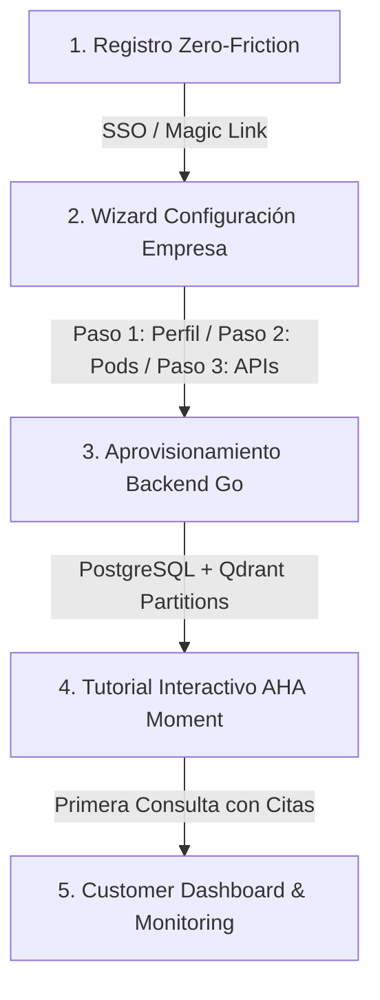

# 📜 SPEC: Protocolo de Onboarding de Clientes & Aprovisionamiento Auto-Servicio
**ID:** SPEC-CORE-21  
**Épica Relacionada:** Portal de Clientes, Growth, Wizard de Configuración & Provisionamiento  
**Estado:** PROPOSED / SPEC-DRIVEN  

---

## 1. Visión y Objetivos

Esta especificación establece el **Protocolo de Onboarding de Clientes (Customer Onboarding Protocol)**. Define el flujo completo desde que un cliente potencial descubre la plataforma en la Landing pública hasta que aprovisiona su empresa, activa sus AI Pods y experimenta su primer valor (*AHA Moment*) en menos de 60 segundos.

---

## 2. Flujo Completo del Customer Journey (5 Fases)



---

## 3. Especificación de las Fases del Onboarding

### 3.1 Fase 1: Registro Cero Fricción (Frictionless Signup)
* **Métodos de Autenticación:**
  - Single Sign-On (SSO) con Google Workspace y Microsoft 365 (Entra ID).
  - Passwordless Magic Link enviando un token firmado JWT por correo transaccional (vía Amazon SES).
* **Política Sin Tarjeta de Crédito:** No se requiere tarjeta de crédito para iniciar el periodo de prueba gratis de 14 días (Trial con 50,000 tokens incluidos).

### 3.2 Fase 2: Wizard Interactivo de Configuración (3 Pasos)

#### Paso 2.1: Perfil de Empresa & Jurisdicción Fiscal
* El cliente ingresa el nombre de su empresa y selecciona su país/jurisdicción fiscal.
* **Pre-Carga Automática:** Si selecciona Argentina, el sistema asocia automáticamente el corpus público actualizado de AFIP/ARCA a su espacio sin costo adicional.

#### Paso 2.2: Selección e Instanciación de AI Pods
* El cliente selecciona los Pods iniciales que desea activar con 1 clic:
  - `[x] Pod AFIP / ARCA & Balances`
  - `[x] Pod Cadena de Suministros (SCM/WMS)`
  - `[x] Pod EvoCRM / Helpdesk`
* **Migración del Sandbox:** Si el cliente probó un PDF en el Sandbox interactivo pre-login, el sistema muestra el checkbox *"Guardar el documento del Sandbox en mi nuevo tenant"* activado por defecto.

#### Paso 2.3: Conexión de APIs / ERPs (Opcional)
* Asistente visual con instrucciones y credenciales generadas automáticamente para conectar Odoo, SAP, EvoCRM o WhatsApp.

### 3.3 Fase 3: Aprovisionamiento Automático Zero-Touch (Backend en Go)
Al hacer clic en *"Finalizar y Crear mi Espacio"*, el motor en Go ejecuta en $< 2,000\text{ms}$:
1. Asigna un `tenant_id` UUIDv4 único con estado `TRIAL_ACTIVE`.
2. Crea las particiones SQL en PostgreSQL 16 y los índices vectoriales filtrados por `tenant_id` en Qdrant Cluster.
3. Transfiere de forma inmutable los documentos del Sandbox a la carpeta privada del tenant en AWS S3.

### 3.4 Fase 4: Tutorial Interactivo "AHA Moment" (< 60 Segundos)
* **Tour Guiado:** Un micro-tutorial en la pantalla de chat muestra al cliente cómo hacer su primera consulta (ej: *"¿Cómo genero mi clave AFIP en Odoo?"*).
* **Demostración de Citas:** El sistema responde resaltando la cita textual y el número de página, logrando que el cliente experimente inmediatamente la confiabilidad del sistema (cero alucinaciones).

---

## 4. Escenario BDD de Onboarding de Cliente

```gherkin
Given un nuevo usuario registrándose mediante Google SSO desde la página del Sandbox
When completa el Wizard de Configuración ingresando "Empresa Demo S.A."
Then el backend en Go debe aprovisionar el tenant_id UUIDv4 en < 2,000 ms
And migrar los documentos del Sandbox efímero al espacio privado del nuevo tenant
And marcar la cuenta como TRIAL_ACTIVE con 50,000 tokens disponibles
And redirigir al Dashboard mostrando el tutorial interactivo del AHA Moment
```
