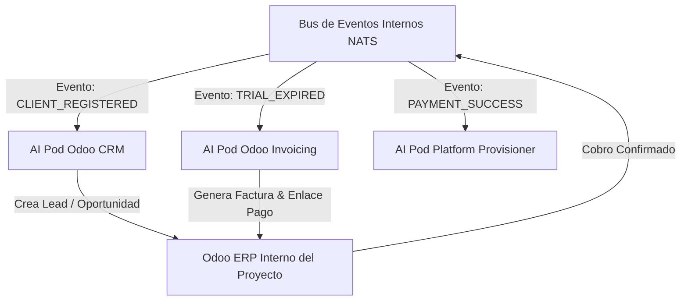

# 📜 SPEC: Arquitectura de Autoconsumo (Dogfooding) para CRM, Facturación y Cobranza Recurrente
**ID:** SPEC-CORE-22  
**Épica Relacionada:** Autoconsumo de AI Pods, Integración Odoo ERP, CRM & Facturación SaaS  
**Estado:** PROPOSED / SPEC-DRIVEN  

---

## 1. Visión y Objetivos

Esta especificación establece la arquitectura de **Autoconsumo / Dogfooding ("Usar nuestro propio producto")**. La plataforma SaaS consumirá sus propios AI Pods especializados (Pod Odoo CRM, Pod Odoo Invoicing/Finance y Pod EvoCRM) para registrar leads de clientes, facturar consumos y gestionar la cobranza post-periodo de prueba de forma automatizada.

---

## 2. Arquitectura de Autoconsumo Basada en Eventos (NATS JetStream)



---

## 3. Especificación de los Flujos Operativos de Autoconsumo

### 3.1 Flujo A: Registro de Lead & Oportunidad en CRM (`CLIENT_REGISTERED`)
1. **Disparo del Evento:** Cuando un usuario completa el registro en la Landing o interactúa con el Sandbox, el API Gateway en Go emite el evento `CLIENT_REGISTERED` a NATS.
2. **Consumo por AI Pod Odoo CRM:**  
   El **Pod Odoo CRM** procesa el mensaje e invoca la herramienta de integración con Odoo ERP (`crear_oportunidad_crm` con `dry_run = false`).
3. **Registro en Odoo ERP:**  
   Se crea automáticamente un registro en el modelo `crm.lead` de Odoo asignando la fuente del lead (*Sandbox / Web Trial*), el país y el interés inicial del cliente.

### 3.2 Flujo B: Cobranza & Facturación Recurrente Post-Trial (`TRIAL_EXPIRED`)
1. **Medición FinOps & Disparo:** Al cumplirse los 14 días de prueba o consumirse los 50,000 tokens gratis, el motor de FinOps emite el evento `TRIAL_EXPIRED`.
2. **Consumo por AI Pod Odoo Invoicing:**  
   El **Pod Odoo Invoicing / Finance** calcula el consumo de tokens adicionales, genera la orden de venta (`sale.order`) y emite la factura electrónica (`account.move`).
3. **Despacho del Enlace de Pago:**  
   El Pod invoca a **EvoCRM** para enviar el link de cobro (Stripe / MercadoPago) por **WhatsApp** y a **Amazon SES** para enviarlo por Email.

### 3.3 Flujo C: Activación Automática de Suscripción (`PAYMENT_SUCCESS`)
1. Al confirmarse el pago en la pasarela, la webhook de Odoo emite el evento `PAYMENT_SUCCESS`.
2. El **Pod Platform Provisioner** conmuta el perfil del tenant de `TRIAL_ACTIVE` a `PROD_ACTIVE`, actualizando las cuotas de tokens y notificando al cliente.

---

## 4. Ventajas Estratégicas del Autoconsumo

* **Demostración Pública en Vivo:** Los clientes ven que la misma plataforma SaaS gestiona su propia facturación y CRM consumiendo sus propios AI Pods.
* **Detección Precoz de Fallos (Dogfooding Invariant):** Si un AI Pod tiene un problema para emitir facturas en Odoo o registrar leads, el equipo interno lo detecta en sus operaciones diarias antes que cualquier usuario externo.

---

## 5. Escenario BDD de Autoconsumo CRM y Facturación

```gherkin
Given un cliente cuyo periodo de prueba gratis de 14 días ha vencido
When el motor de FinOps emite el evento "TRIAL_EXPIRED"
Then el AI Pod Odoo Invoicing debe calcular el consumo de tokens
And invocar a Odoo ERP para generar la orden de venta y factura electrónica
And enviar el enlace de pago al cliente por WhatsApp vía EvoCRM y por Email vía Amazon SES
And al confirmarse el pago, actualizar el estado del tenant a PROD_ACTIVE en < 1,000 ms
```
