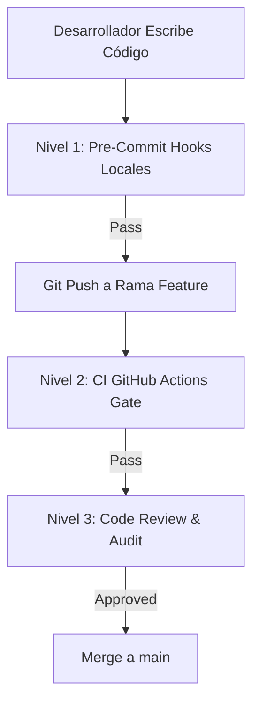

# 📜 SPEC: Código Limpio, Seguridad y Linters Automatizados (Clean Code & Security Linting)
**ID:** SPEC-CORE-08  
**Épica Relacionada:** Gobernanza de Código, Seguridad & CI/CD Gate  
**Estado:** PROPOSED / SPEC-DRIVEN  

---

## 1. Visión y Objetivos

Esta especificación define el estándar de **Código Limpio (Clean Code)**, análisis estático de seguridad y los linters automatizados requeridos para garantizar que todo el código fuente (Go, TypeScript, Terraform y Dockerfiles) sea **auditable**, **legible**, **seguro frente a inyecciones y vulnerabilidades** y libre de deuda técnica.

---

## 2. Herramientas de Linting & Análisis Estático de Seguridad

### 2.1 Backend Core (Go 1.22+) - `golangci-lint`

El desarrollo en Go utilizará **`golangci-lint`** configurado con los siguientes módulos activos obligatorios:

| Linter / Módulo | Función de Seguridad & Calidad | Regla de Bloqueo |
| :--- | :--- | :--- |
| **`gosec`** | Detecta inyecciones SQL, hardcoded secrets, uso de criptografía débil (`md5`/`sha1`), permisos de archivo peligrosos y memory leaks. | **ERROR (Cero tolerancias)** |
| **`errcheck`** | Verifica que TODO error retornado por una función en Go sea capturado y manejado explícitamente (`if err != nil`). | **ERROR** |
| **`govet`** | Examina el código en busca de errores sospechosos (copia ineficiente de mutexes, formateo de printf, etc.). | **ERROR** |
| **`staticcheck`** | Análisis estático avanzado para simplificación de expresiones y detección de código inalcanzable. | **WARN / ERROR** |
| **`revive` & `stylecheck`** | Enforza el estilo idiomático de Go (nombres de variables concisos, exportación correcta de structs/métodos). | **WARN** |
| **`goconst` & `dupl`** | Evita la repetición de cadenas mágicas y código duplicado. | **WARN** |

### 2.2 Seguridad de la Cadena de Suministro (Supply Chain & Secret Prevention)

* **`gitleaks`:** Herramienta ejecutada en pre-commit y CI para prevenir la subida accidental de llaves privadas, API Keys de OpenAI/Anthropic/AWS o tokens JWT al repositorio.
* **`Trivy` (Aqua Security):** Escaneo de imágenes de contenedores Docker y dependencias `go.mod` / `package.json` en busca de vulnerabilidades clasificadas como `CRITICAL` o `HIGH`.

### 2.3 Frontend (TypeScript & React)

* **`ESLint` (con `@typescript-eslint` y `eslint-plugin-security`):** Enforza tipado estricto (prohibido el uso de `any`), previene vulnerabilidades XSS (evaluaciones inseguras del DOM).
* **`Prettier`:** Formateo automático de sintaxis.

---

## 3. Proceso de Enforzamiento en 3 Niveles (3-Tier Quality Gate)



### Nivel 1: Hook Pre-Commit Local (`.pre-commit-config.yaml`)
Antes de permitir un `git commit`, la máquina local del desarrollador ejecuta automáticamente:
1. `gitleaks protect --staged` (Bloquea si hay claves/secretos).
2. `gofmt -s -w` / `prettier --write` (Formateo automático).
3. `golangci-lint run --fast` (Linting rápido de sintaxis).

### Nivel 2: Gate de Integración Continua (CI Pipeline en GitHub)
Todo Pull Request a la rama `main` ejecuta el pipeline automatizado. **El Merge se bloquea si:**
* `golangci-lint` o `gosec` encuentran cualquier error de seguridad o manejo de errores no capturado.
* La cobertura de pruebas unitarias (`go test -cover`) es **inferior al 80%**.
* `Trivy` encuentra vulnerabilidades críticas en la imagen compilada.

### Nivel 3: Guías de Código Limpio (Clean Code Rules for Go)
1. **Manejo Explícito de Errores:** Prohibido ignorar errores con `_`. Todo error debe ser retornado envuelto (`fmt.Errorf("contexto: %w", err)`).
2. **Funciones Pequeñas y Enfocadas:** Ninguna función debe superar las 50 líneas de código ni tener una complejidad ciclomática superior a 10.
3. **Inmutabilidad y Contexto:** Todas las funciones de acceso a datos deben recibir `ctx context.Context` como primer parámetro con timeout implícito.

---

## 4. Archivo de Configuración de Linter (`.golangci.yml`)

```yaml
run:
  timeout: 5m
  issues-exit-code: 1
  tests: true

linters-settings:
  gosec:
    severity: "medium"
    confidence: "medium"
  errcheck:
    check-type-assertions: true
    check-blank: true

linters:
  enable:
    - gosec
    - errcheck
    - govet
    - staticcheck
    - revive
    - stylecheck
    - goconst
    - dupl
    - unused
```
